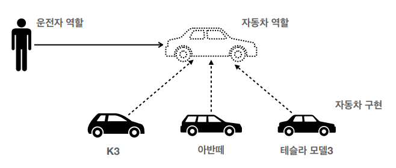

# 1. 스프링 생태계


- 스프링은 특정한 하나가 아니라, 여러 기술들의 모음이다.
- 필수
    - 스프링 프레임워크 
        - 핵심기술 : 스프링 DI컨테이너, AOP, 이벤트, 기타
        - 웹 기술 : 스프링 MVC, 스프링 WebFlux
        - 데이터 접근 기술 : 트랜잭션, JDBC, ORM 지원, XML 지원
        - 기술 통합 : 캐시, 이메일, 원격접근, 스케줄링
        - 테스트 : 스프링 기반 테스트 지원
        - 언어 : 코틀린, 그루비
    - 스프링 부트
        - 여러 스프링 기술들을 편리하게 사용할 수 있도록 도움
        - 단독으로 실행할 수 있는 스프링 애플리케이션을 쉽게 생성
        - Tomcat같은 웹 서버를 내장해서 별도의 웹 서버를 설치하지 않아도 됨
        - 손쉬운 빌드 구성을 위한 starter 종속성 제공
        - 스프링과 3rd party(외부) 라이브러리 자동 구성
        - 메트릭, 상태확인, 외부구성 같은 프로덕션 준비 기능 제공(모니터링)
        - 간결한 설정
- 선택
    - 스프링 데이터 : 기본적인 CRUD기술을 편리하게 사용할 수 있도록 도움 (ex) SpringDataJPA
    - 스프링 세션 : 세션기능을 편리하게 사용할 수 있도록
    - 스프링 시큐리티 : 보안관련

- **Spring**이 가지는 의미 3가지
1. 스프링 DI 컨테이너 기술
2. 스프링 프레임워크
3. 스프링 부트, 스프링 프레임워크 등을 모두 포함한 스프링 생태계 전체 

# 2. 스프링의 핵심개념
> 이 기술을 왜 만들었는가? 이 기술의 핵심 컨셉은 무엇인가?
- 스프링은 자바 언어 기반의 프레임워크
- 자바 언어의 가장 큰 특징 = 객체 지향 언어
- **스프링은 객체 지향 언어가 가진 강력한 특징을 살려내는 프레임워크**
- **스프링은 <U>좋은 객체 지향</U> 애플리케이션을 개발할 수 있게 도와주는 프레임워크** (ex) DI, IOC

# 3. 좋은 객체지향 프로그래밍
- 객체지향의 특징 : 추상화, 캡슐화, 상속, 다형성
- 객체지향 프로그래밍   
: 컴퓨터 프로그램을 명령어의 목록으로 보는 시각에서 벗어나 여러개의 독립된 단위, 즉 객체들의 모임으로 파악하고자 하는 것   
: 각각의 객체는 메시지를 주고받고, 데이터를 처리할 수 있음   
: 객체지향 프로그래밍을 통해 프로그램은 유연하고 변경이 용이해짐

# 4. 다형성
> <U>**역할**</U>과 <U>**구현**</U>

- 역할 : 인터페이스
- 구현 : 인터페이스를 구현한 클래스, 구현 객체

**클라이언트에 영향을 주지 않고 새로운 기능을 제공할 수 있다.**



- 자동차(구현)가 바뀌어도 운전자(클라이언트)에게는 아무런 영향을 주지 않는다.
- 운전자는 자동차 역할인 interface에만 의존할 뿐, 해당 interface가 무엇으로 구현되었는지는 알 필요가 없다. → 자동차 구현체는 무한히 확장이 가능하다.   

**역할과 구현을 분리**
- 클라이언트는 대상의 역할(인터페이스)만 알면 된다.
- 클라이언트는 구현 대상의 내부 구조를 몰라도 된다.
- 클라이언트는 구현 대상의 내부 구조가 변경되어도 영향을 받지 않는다.
- 클라이언트는 구현 대상 자체를 변경해도 영향을 받지 않는다.

**객체 설계**
- 객체 설계시 역할과 구현을 명확히 분리하기
- 역할(인터페이스)를 먼저 부여하고, 그 역할을 수행하는 구현 객체 만들기

> 다형성의 본질
- 인터페이스를 구현한 객체 인스턴스를 실행 시점에 유연하게 변경할 수 있다.
- 클라이언트를 변경하지 않고 서버의 구현 기능을 유연하게 변경할 수 있다.

# 5. 좋은 객체 지향 설계의 5가지 원칙, SOLID

> Single Responsibility Principle, 단일 책임 원칙
- 한 클래스는 하나의 책임만 가져야 한다.
- 변경이 있을때 파급 효과가 적으면 단일 책임 원칙을 잘 따른 것 (ex) UI변경, 객체의 생성과 사용을 분리

> Open Closed Principle, 개방-폐쇄 원칙
- 소프트웨어 요소는 <U>**확장에는 열려**</U> 있으나 <U>**변경에는 닫혀**</U> 있어야 한다.
- 다형성을 활용하기
- 인터페이스를 구현한 새로운 클래스를 하나 만들어서 새로운 기능을 구현
```
public class MemberService {
    private MemberRepository memberRepository = new MemoryMemberRepository();
}
```

```
public class MemberService {
//  private MemberRepository memberRepository = new MemoryMemberRepository();    
    private MemberRepository memberRepository = new JdbcMemberRepository();
}
```

- 위 코드의 문제점은,
    - MemberService(클라이언트)가 구현 클래스를 직접 선택
    - 구현 객체를 변경하려면 클라이언트의 코드를 수정해야 함 → 변경에는 닫혀있어야 한다는 OCP원칙 위배
    - 분명 다형성을 사용했지만 OCP원칙을 지킬 수 없다 (MemberRepository라는 인터페이스를 MemoryMemberRepository와 JdbcMemberRepository 두개로 구현하였기에 다형성은 만족, 하지만 구현체 변경시 클라이언트의 코드를 수정해야함으로 OCP 위반)

> Liskov Substitution Principle, 리스코프 치환 원칙
- 프로그램의 객체는 프로그램의 정확성을 깨뜨리지 않으면서 하위 타입의 인스턴스로 바꿀 수 있어야 한다.
    - (ex) 악셀() 기능 개발시 속도가 높아지는 게 정상. 그러나 속도가 느려지게 개발하더라도 컴파일 오류는 나지 않음. 하지만 프로그램의 정확성을 깨뜨렸으므로 LSP위배
    - 즉, 구현체는 상위 인터페이스에서 정해둔 규약을 지켜가며 구현해야한다.
- 다형성에서 하위 클래스는 <U>인터페이스 규약을 다 지켜야 한다는 것.</U> 다형성을 지원하기 위한 원칙, 인터페이스를 구현한 구현체를 믿고 사용하려면 이 원칙이 필요하다.

> Interface Segregation Principle, 인터페이스 분리 원칙
- 특정 클라이언트를 위한 인터페이스 여러 개가 범용 인터페이스 하나보다 낫다.
- 자동차 인터페이스 → 운전 인터페이스, 정비 인터페이스로 분리
- 사용자 클라이언트 → 운전자 클라이언트, 정비사 클라이언트로 분리
    - 분리하면 정비 인터페이스 자체가 변해도 운전자 클라이언트에 영향을 주지 않음.
    - 인터페이스가 명확해지고, 대체 가능성이 높아진다.
- 각 인터페이스가 맡을 역할의 범위를 적당히 잘 쪼개두기

> Dependency Inversion Principle, 의존관계 역전 원칙
- 구체화가 아닌 추상화에 의존하기
- 구현 클래스가 아니라 인터페이스(역할)에 의존하기
```
public class MemberService {
    private MemberRepository memberRepository = new MemoryMemberRepository();
}
```

```
public class MemberService {
//  private MemberRepository memberRepository = new MemoryMemberRepository();    
    private MemberRepository memberRepository = new JdbcMemberRepository();
}
```

- 앞서 OCP에서 살펴본 위 코드는 MemberService가 클라이언트 코드인데도 불구하고, 인터페이스(MemberRepository)와 구현클래스(MemoryMemberRepository, JdbcMemberRepository) 모두 의존하고 있다.
- 클라이언트 코드는 구현체를 바라볼 필요 없이, 인터페이스(역할)만 바라보면 됨

> 정리
- 객체 지향의 핵심은 다형성
- 다형성 만으로는 OCP, DIP를 지킬 수 없다

# 6. 객체 지향 설계와 스프링
- 스프링은 다형성 + OCP, DIP를 모두 실천하기 위해 다음과 같은 기술을 지원한다.
    - DI(Dependency Injection) : 의존관계, 의존성 주입
    - DI 컨테이너 제공
- 이를 통해 클라이언트 코드의 변경 없이 기능을 확장할 수 있다.

# 7. 정리
- 모든 설계에 역할과 구현을 분리하기
- 애플리케이션 설계는 역할(interface)만 만들어두고, 구현체는 언제든지 유연하게 변경할 수 있도록 만드는 것이 좋은 객체 지향 설계이다.
- 이상적으로는 모든 설계에 인터페이스를 부여하기
- 인터페이스 도입시 주의할 점은, <U>**추상화라는 비용이 발생**</U>
    - 런타임시에 클라이언트 코드(service)에서 이걸 구현하는게 무엇인지 확인하기 위해 service가 의존하고 있는 interface를 들어가보면, 실제 구현 코드를 확인할 수 없음. 이렇게 추상화로 인해 depth가 하나 더 추가된다는 비용 발생.
- 기능을 확장할 가능성이 없다면 구체 클래스를 직접 사용하고, 향후 꼭 필요할 때 리팩토링해서 인터페이스를 도입하는 것도 추천.