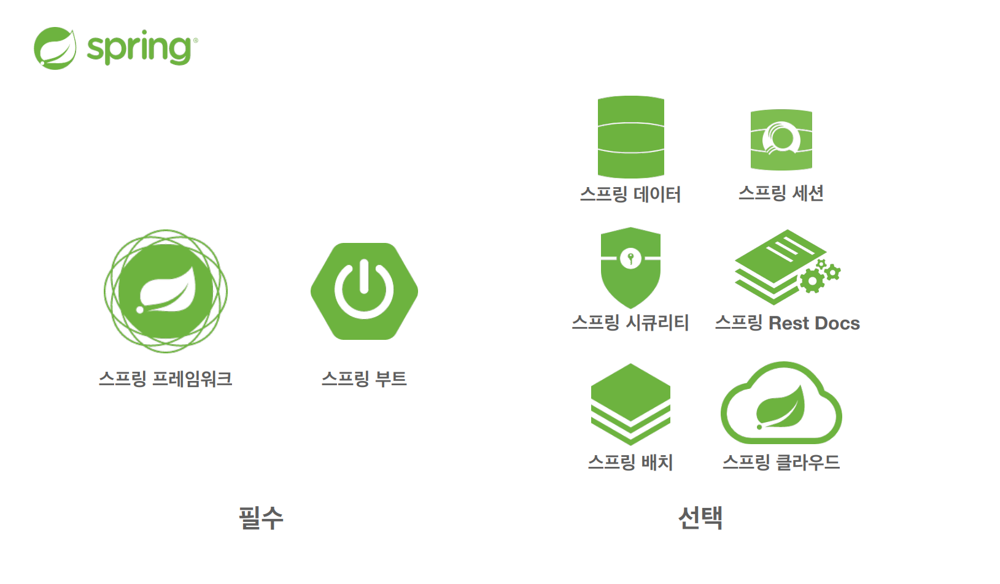

# 1. 스프링 생태계

- 스프링은 특정한 하나가 아니라, 여러 기술들의 모음이다.
- 필수
    - 스프링 프레임워크 
        - 핵심기술 : 스프링 DI컨테이너, AOP, 이벤트, 기타
        - 웹 기술 : 스프링 MVC, 스프링 WebFlux
        - 데이터 접근 기술 : 트랜잭션, JDBC, ORM 지원, XML 지원
        - 기술 통합 : 캐시, 이메일, 원격접근, 스케줄링
        - 테스트 : 스프링 기반 테스트 지원
        - 언어 : 코틀린, 그루비
    - 스프링 부트
        - 여러 스프링 기술들을 편리하게 사용할 수 있도록 도움
        - 단독으로 실행할 수 있는 스프링 애플리케이션을 쉽게 생성
        - Tomcat같은 웹 서버를 내장해서 별도의 웹 서버를 설치하지 않아도 됨
        - 손쉬운 빌드 구성을 위한 starter 종속성 제공
        - 스프링과 3rd party(외부) 라이브러리 자동 구성
        - 메트릭, 상태확인, 외부구성 같은 프로덕션 준비 기능 제공(모니터링)
        - 간결한 설정
- 선택
    - 스프링 데이터 : 기본적인 CRUD기술을 편리하게 사용할 수 있도록 도움 (ex) SpringDataJPA
    - 스프링 세션 : 세션기능을 편리하게 사용할 수 있도록
    - 스프링 시큐리티 : 보안관련

- **Spring**이 가지는 의미 3가지
1. 스프링 DI 컨테이너 기술
2. 스프링 프레임워크
3. 스프링 부트, 스프링 프레임워크 등을 모두 포함한 스프링 생태계 전체 

# 2. 스프링의 핵심개념
> 이 기술을 왜 만들었는가? 이 기술의 핵심 컨셉은 무엇인가?
- 스프링은 자바 언어 기반의 프레임워크
- 자바 언어의 가장 큰 특징 = 객체 지향 언어
- **스프링은 객체 지향 언어가 가진 강력한 특징을 살려내는 프레임워크**
- **스프링은 <U>좋은 객체 지향</U> 애플리케이션을 개발할 수 있게 도와주는 프레임워크** (ex) DI, IOC

# 3. 좋은 객체지향 프로그래밍

