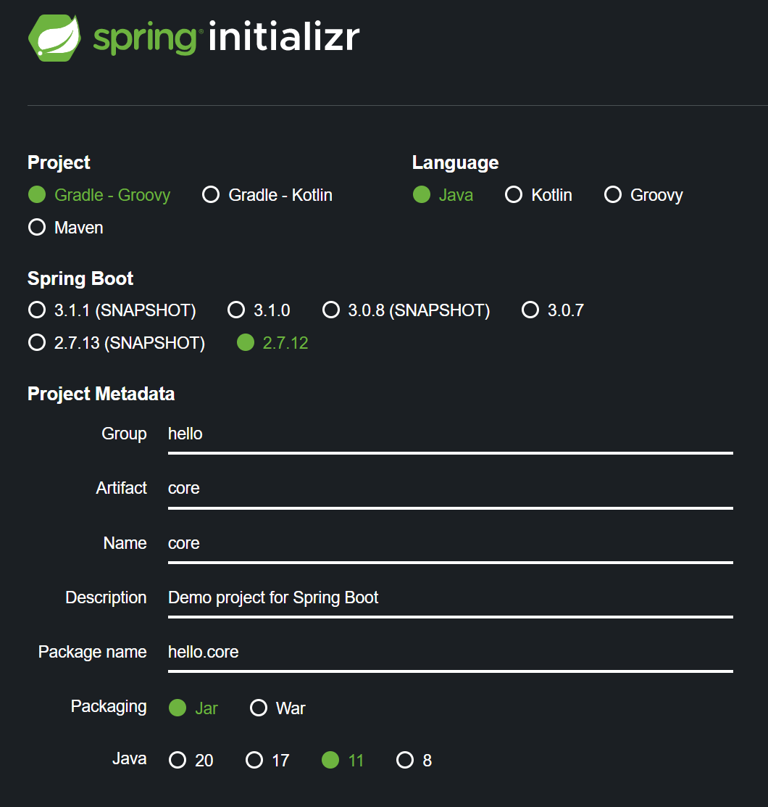
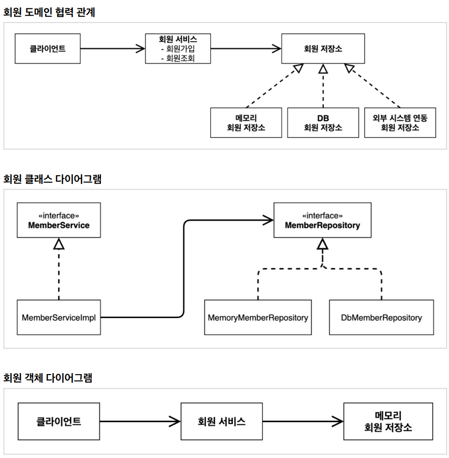

# 1. 프로젝트 생성

- artifact : 프로젝트 빌드명
- SpringBoot버전을 3.1.0으로 진행했더니 계속해서 에러발생
- SpringBoot 3.x이면 java 17과 호환이 된다고 하여 2.7.12로 진행   
[→ <U>참고링크</U>](https://velog.io/@m2nja201/build.gradle-%EC%98%A4%EB%A5%98-%ED%94%84%EB%A1%9C%EC%A0%9D%ED%8A%B8-%EC%83%9D%EC%84%B1-%EC%8B%9C-gradle-%EC%98%A4%EB%A5%98-spring-boot-intelliJ)
- dependency를 아무것도 추가하지 않은 상태라 build.gradle에 가보면 spring-boot-starter와 테스트 관련 spring-boot-starter-test 두개만 설정되어 있음 → 스프링의 핵심 라이브러리들

# 2. 비즈니스 요구사항과 설계
1. 회원
- 회원을 가입하고 조회할 수 있다.
- 회원은 일반과 VIP 두 가지 등급이 있다.
- 회원 데이터는 자체 DB를 구축할 수 있고, 외부 시스템과 연동할 수 있다. (미확정)
2. 주문과 할인 정책
- 회원은 상품을 주문할 수 있다.
- 회원 등급에 따라 할인 정책을 적용할 수 있다.
- 할인 정책은 모든 VIP는 1000원을 할인해주는 고정 금액 할인을 적용해달라.(나중에 변경 가능성)
- 할인 정책은 변경 가능성이 높다. 회사의 기본 할인 정책을 아직 정하지 못했고, 오픈 직전까지 고민을 미루고 싶다. 최악의 경우 할인을 적용하지 않을 수도.(미확정)

# 3. 회원 도메인 설계

- 회원 객체 다이어그램에서 회원 서비스는 = MemberServiceImpl
- 도메인 협력관계 : 기획자들도 볼 수 있는 그림. 이걸 바탕으로 개발자가 구체화해서 클래스 다이어그램을 만들어냄
- 클래스 다이어그램 : 인터페이스와 구현체. 서버를 실행하지 않고 클래스들만 분석해서 볼 수 있는 그림
- 객체 다이어그램 : 실제 동작시 사용하는 인스턴스끼리의 참조 관계를 설명

# 4. 회원 도메인 개발
- Tip.
    - interface와 interfaceImpl(구현체)를 다른 패키지에 두는 것이 설계상 더 좋음.
    - MemoryMemberRepository에서 static HashMap을 만들어 사용했는데, 실무에선 동시성 문제때문에 ConcurrentHashMap을 사용. (→ [<U>참고</U>](https://applepick.tistory.com/124) )
    - Impl이란건 implements를 줄여 사용하는 것인데, 인터페이스의 구현체가 <U>단 하나</U>일 경우 ~Impl이라고 관례상 많이 사용한다.

# 5. 회원 도메인 실행과 테스트 