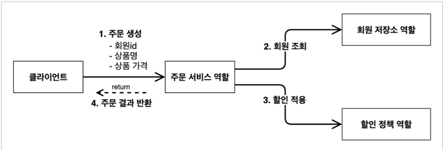
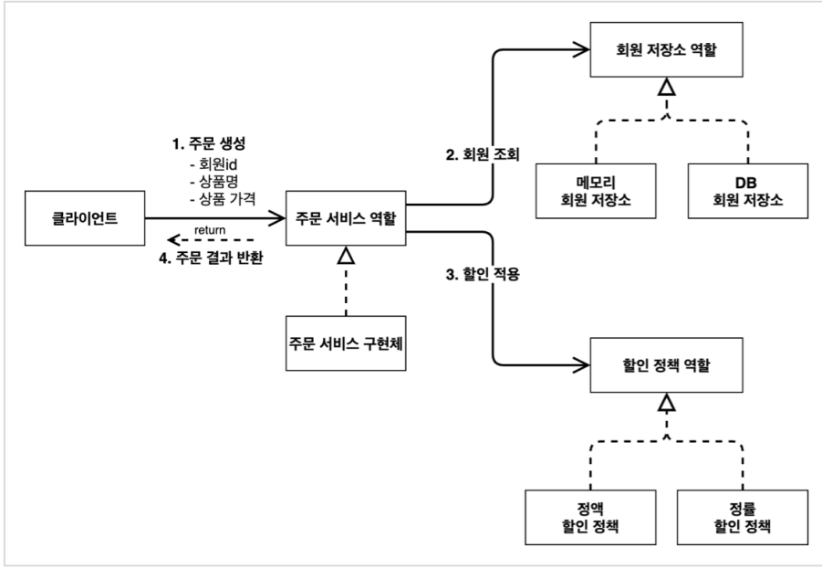
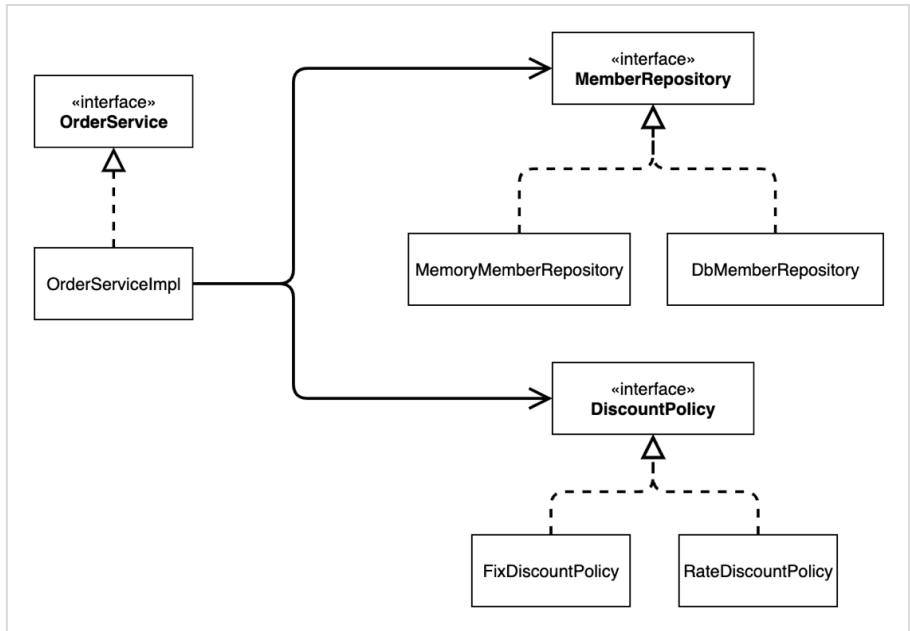
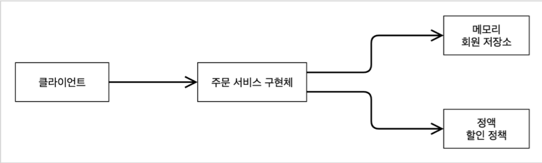
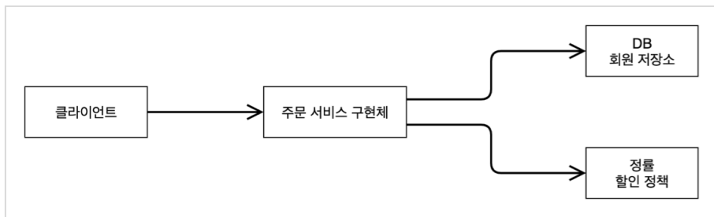

# 1. 프로젝트 생성


- artifact : 프로젝트 빌드명
- SpringBoot버전을 3.1.0으로 진행했더니 계속해서 에러발생
- SpringBoot 3.x이면 java 17과 호환이 된다고 하여 2.7.12로 진행   
[→ <U>참고링크</U>](https://velog.io/@m2nja201/build.gradle-%EC%98%A4%EB%A5%98-%ED%94%84%EB%A1%9C%EC%A0%9D%ED%8A%B8-%EC%83%9D%EC%84%B1-%EC%8B%9C-gradle-%EC%98%A4%EB%A5%98-spring-boot-intelliJ)
- dependency를 아무것도 추가하지 않은 상태라 build.gradle에 가보면 spring-boot-starter와 테스트 관련 spring-boot-starter-test 두개만 설정되어 있음 → 스프링의 핵심 라이브러리들

# 2. 비즈니스 요구사항과 설계
1. 회원
- 회원을 가입하고 조회할 수 있다.
- 회원은 일반과 VIP 두 가지 등급이 있다.
- 회원 데이터는 자체 DB를 구축할 수 있고, 외부 시스템과 연동할 수 있다. (미확정)
2. 주문과 할인 정책
- 회원은 상품을 주문할 수 있다.
- 회원 등급에 따라 할인 정책을 적용할 수 있다.
- 할인 정책은 모든 VIP는 1000원을 할인해주는 고정 금액 할인을 적용해달라.(나중에 변경 가능성)
- 할인 정책은 변경 가능성이 높다. 회사의 기본 할인 정책을 아직 정하지 못했고, 오픈 직전까지 고민을 미루고 싶다. 최악의 경우 할인을 적용하지 않을 수도.(미확정)

# 3. 회원 도메인 설계


- 회원 객체 다이어그램에서 회원 서비스는 = MemberServiceImpl
- 도메인 협력관계 : 기획자들도 볼 수 있는 그림. 이걸 바탕으로 개발자가 구체화해서 클래스 다이어그램을 만들어냄
- 클래스 다이어그램 : 인터페이스와 구현체. 서버를 실행하지 않고 클래스들만 분석해서 볼 수 있는 그림(정적인 다이어그램)
- 객체 다이어그램 : 실제 동작시 사용하는 인스턴스끼리의 참조 관계를 설명(동적인 다이어그램)

# 4. 회원 도메인 개발
- Tip.
    - interface와 interfaceImpl(구현체)를 다른 패키지에 두는 것이 설계상 더 좋음.
    - MemoryMemberRepository에서 static HashMap을 만들어 사용했는데, 실무에선 동시성 문제때문에 ConcurrentHashMap을 사용. (→ [<U>참고</U>](https://applepick.tistory.com/124) )
    - Impl이란건 implements를 줄여 사용하는 것인데, 인터페이스의 구현체가 <U>단 하나</U>일 경우 ~Impl이라고 관례상 많이 사용한다.

# 5. 회원 도메인 실행과 테스트 
```java
public class MemberServiceTest {

    MemberService memberService = new MemberServiceImpl();
    @Test
    void join(){
        //given
        Member member = new Member(1L, "memberA", Grade.VIP);

        //when
        memberService.join(member);
        Member findMember = memberService.findMember(1L);

        //then
        Assertions.assertThat(member).isEqualTo(findMember);
    }
}
```

**회원 도메인 설계의 문제점**
- 다른 저장소로 변경할 때 OCP원칙을 잘 준수할까? → NO
- DIP를 잘 지키고 있나? → NO
- 이유
    ```java
    public class MemberServiceImpl implements MemberService{
        private final MemberRepository memberRepository = new MemoryMemberRepository();
    }
    ```
    - ServiceImpl(클라이언트 코드)에서 memberRepository(역할, 추상, 인터페이스)와 MemoryMemberRepostiory(구현, 구체화) 둘 다 의존하고 있음. → DIP위반
    - 또한 다른 저장소로 변경시 클라이언트 코드인 ServiceImpl를 변경해주어야 함. → OCP위반

# 6. 주문과 할인 도메인 설계

**주문과 할인정책**
- 회원은 상품을 주문할 수 있다.
- 회원 등급에 따라 할인 정책을 적용할 수 있다.
- 할인 정책은 모든 VIP는 1000원을 할인해주는 고정 금액 할인을 적용해달라. (나중에 변경 될 수도 있다.)
- 할인 정책은 변경 가능성이 높다. 회사의 기본 할인 정책을 아직 정하지 못했고, 오픈 직전까지 고민을 미루고 싶다. 최악의 경우 할인을 적용하지 않을 수 있다. → 나중에 변경될 가능성때문에 추상화 작업 필요

**주문 도메인 협력, 역할, 책임**


1. 주문생성 : 클라이언트는 주문 서비스에 주문 생성을 요청한다
2. 회원조회 : 할인을 위해서는 회원 등급이 필요. 그래서 주문 서비스는 회원 저장소에서 회원을 조회
3. 할인적용 : 주문 서비스는 회원 등급에 따른 할인 여부를 할인 정책에 위임
4. 주문 결과 반환 : 주문 서비스는 할인 결과를 포함한 주문 결과를 반환

**주문 도메인 전체 및 클래스 다이어그램**



- <U>우선 역할을 먼저 설계한 후에 구현을 설계</U>하면 보다 쉽게 도메인 설계가 가능하다.
- 이렇게 역할과 구현을 분리해서 설계하면 회원 저장소는 물론 할인 정책까지 유연하게 변경 가능하다.

**주문 도메인 객체 다이어그램**



- 회원을 메모리에서 조회하고, 정액 할인 정책을 지원해도 주문 서비스를 변경할 필요가 없다.
- 그 반대로 회원을 메모리가 아닌 실제 DB에서 조회하고, 정률 할인 정책을 지원해도 주문 서비스를 변경할 필요가 없다.
- 즉, 구현체가 바뀌어도 역할들의 협력 관계를 그대로 재사용 할 수 있다.

# 7. 주문과 할인 도메인 개발
**개발내용**
- DiscountPolicy(할인정책) : 할인적용(회원정보, 상품가격)
- FixDiscountPolicy(할인정책의 구현체 - 정액할인) : 회원이 VIP등급이라면 1000원 할인. 그렇지 않다면 0원 할인.
- Order(주문객체)
- OrderService(주문서비스) : 주문생성(회원id, 상품명, 상품가격)
- OrderServiceImpl(주문서비스구현체)
    - 1.주문하는 회원정보를 조회하여 해당 회원의 등급 알아내기 : 회원조회
    - 2.회원등급에 따른 할인가격 알아내기 : 할인적용

# 8. 주문과 할인 도메인 실행과 테스트
**주문과 할인정책 실행하기**
```java
public class OrderApp {
    public static void main(String[] args){
        MemberService memberService = new MemberServiceImpl();
        OrderService orderService = new OrderServiceImpl();

        // 등급이 VIP인 회원생성
        Long memberId = 1L;
        Member member = new Member(memberId, "memberA", Grade.VIP);
        memberService.join(member);

        // 해당회원으로 주문 생성
        Order order = orderService.createOrder(memberId, "itemA", 10000);

        System.out.println("order = " + order);
    }
}
```
- 결과
    - order = Order{memberId=1, itemName='itemA', itemPrice=10000, discountPrice=1000}
    - 회원이 VIP등급이고, 할인정책은 정액제를 선택했으니 discountPrice는 1000원이 맞다.
    - 결과는 정상적으로 출력되었으나, 애플리케이션 로직으로 테스트를 수행하는 것은 좋은 방법이 아니다. JUnit테스트를 이용하자.

**주문과 할인정책 테스트**
```java
class OrderServiceTest {
    MemberService memberService = new MemberServiceImpl();
    OrderService orderService = new OrderServiceImpl();

    @Test
    void createOrder() {
        // 등급이 VIP인 회원생성
        Long memberId = 1L;
        Member member = new Member(memberId, "memberA", Grade.VIP);
        memberService.join(member);

        // 해당 회원으로 주문 생성하기
        Order order = orderService.createOrder(memberId, "itemA", 10000);

        // 검증하기
        Assertions.assertThat(order.getDiscountPrice()).isEqualTo(1000);
    }
}
```