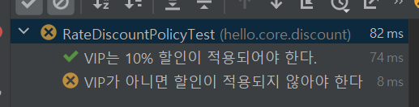
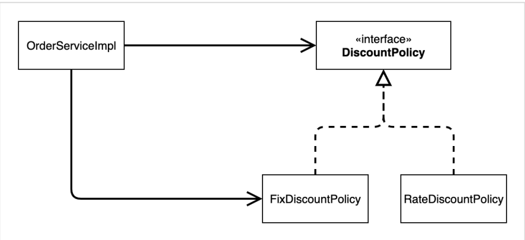
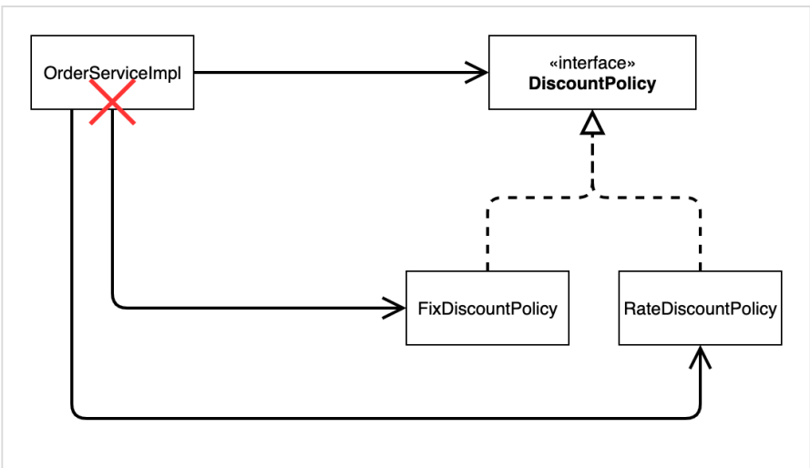
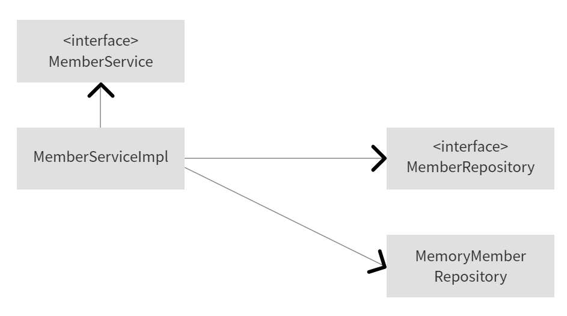
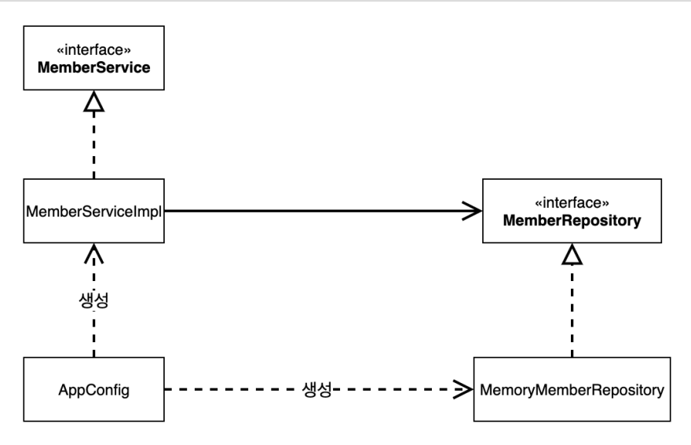
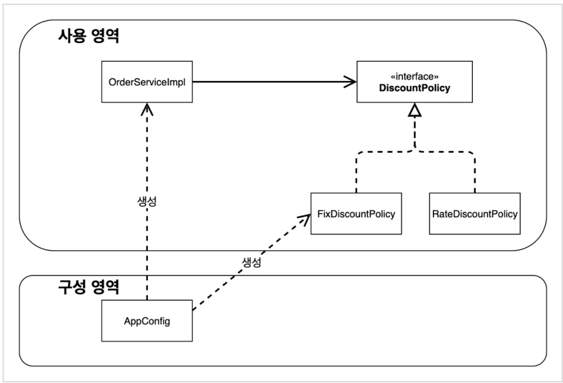
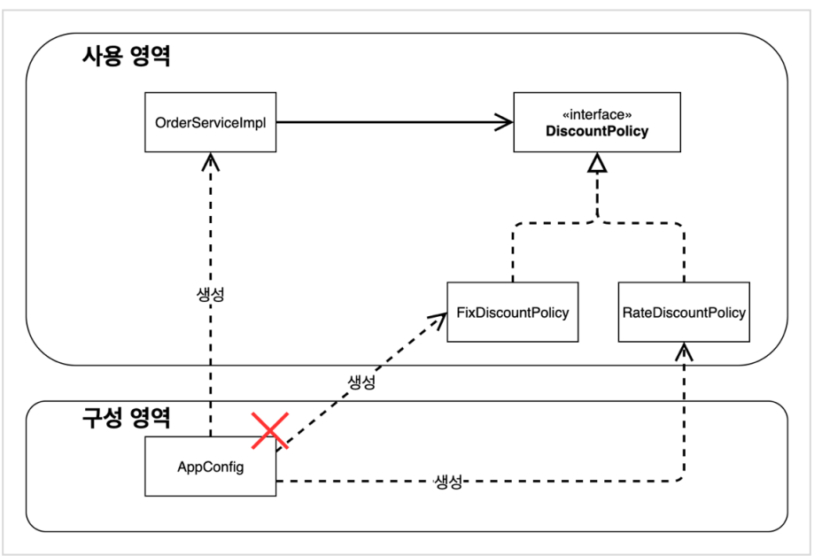
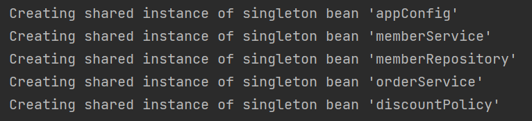

# 1. 새로운 할인 정책 개발
## 할인 정책을 추가하고 해당 정책에 대한 테스트 진행
```java
class RateDiscountPolicyTest {

    RateDiscountPolicy discountPolicy = new RateDiscountPolicy();

    @Test
    @DisplayName("VIP는 10% 할인이 적용되어야 한다.")
    void vip_o(){
        //given
        Member member = new Member(1L, "memberVIP", Grade.VIP);
        //when
        int discount = discountPolicy.discount(member, 10000);
        //then
        assertThat(discount).isEqualTo(1000);
    }

    //  실패를 유도하는 테스트도 필요함
    @Test
    @DisplayName("VIP가 아니면 할인이 적용되지 않아야 한다")
    void vip_x(){
        //given
        Member member = new Member(2L, "memberBASIC", Grade.BASIC);
        //when
        int discount = discountPolicy.discount(member, 10000);
        //then
        assertThat(discount).isEqualTo(0);
    }
}
```

- JUnit5부터 @DisplayName을 통해 테스트명을 붙여줄 수 있다. 테스트 실행시, DisplayName에 적은 이름으로 결과가 표출된다. (아래)

    

- vip_x()의 경우, VIP가 아닌 고객은 할인이 적용되지 않아야 한다는 예외사항을 테스트하고 있다. 이처럼 어떤 기능을 개발했을때 해당 기능이 잘 동작되는지만 테스트할 것이 아니라, 오류 또는 예외가 발생해야하는 상황을 가정하여 오류나 예외가 잘 발생하는지 테스트해줄 필요가 있다.

# 2. 새로운 할인 정책 적용과 문제점
## 할인 정책을 애플리케이션에 적용하기

```java
public class OrderServiceImpl implements OrderService{
    private final MemberRepository memberRepository = new MemoryMemberRepository();
//    private final DiscountPolicy discountPolicy = new FixDiscountPolicy();
    private final DiscountPolicy discountPolicy = new RateDiscountPolicy();

}
```

- 문제점
    - 할인 정책을 변경하려면 <U>**할인(Discount)의 클라이언트**</U>인 주문(OrderServiceImpl) 코드를 변경해야한다.
    - 그 이유는 클라이언트 코드인 OrderServiceImpl는 추상(인터페이스)뿐만 아니라 동시에 구체(구현)클래스에도 의존을 하고 있기 때문 → DIP 위반
        - 추상(인터페이스)의존 : DiscountPolicy
        - 구체(구현)클래스 : FixDiscountPolicy, RateDiscountPolicy
    - 또한 기능을 확장해서 변경하면, 클라이언트 코드에 계속해서 영향을 줄 것이다. → OCP(변경없이확장) 위반

## 실제의존관계



## 기능추가시 변경된 의존관계



# 3. 관심사의 분리
## 현재코드의 문제점

- 클라이언트는 어떤 구현체가 선택되더라도 본인의 역할을 수행할 수 있어야 함. → 하지만 현재 코드에서 클라이언트는 구현체가 변경될 때, 자신의 코드를 수정하지 않고서는 기능을 수행할 수 없음
- 애플리케이션을 구성하고, 역할에 맞는 구현체를 선택하는 별도의 '기획자'가 필요. → AppConfig 클래스 생성

## AppConfig 등장
- 애플리케이션의 전체 동작 방식을 구성하기 위해, 구현 객체를 생성하고, 연결하는 책임을 가지는 별도의 설정 클래스
- 생성자 주입방식으로 구현 객체를 생성, 연결시켜 줌. → <U>**의존관계 주입**</U>
```java
public class AppConfig {
    
    public MemberService memberService(){
        return new MemberServiceImpl(new MemoryMemberRepository());
    }

    public OrderService orderService(){
        return new OrderServiceImpl(new MemoryMemberRepository(), new FixDiscountPolicy());
    }
}
```
- 애플리케이션의 실제 동작에 필요한 구현 객체를 생성.
    - MemberServiceImpl
    - MemoryMemberRepository
    - OrderServiceImpl
    - FixDiscountPolicy
- 생성한 객체 인스턴스의 참조(레퍼런스)를 생성자를 통해서 주입(연결)해줌.
    - MemberServiceImpl → MemoryMemberRepository
    - OrderServiceImpl → MemoryMemberRepository, FixDiscountPolicy

##  AppConfig의 등장으로 변경된 코드
```java
public class MemberServiceImpl implements MemberService{

    //기존 - Impl에서 인터페이스(MemberRepository)와 구현체(MemoryMemberRepository) 모두 선택
    MemberRepository memberRepository = new MemoryMemberRepository();

    //변경 - Impl에서 인터페이스만 선택
    private final MemberRepository memberRepository;

    public MemberServiceImpl(MemberRepository memberRepository) {
        this.memberRepository = memberRepository;
    }
}
```
- 설계 변경으로 MemberServiceImpl은 더이상 MemoryMemberRepository를 의존하지 않음
- MemberServiceImpl입장에선 생성자를 통해 어떤 구현 객체가 들어올지(주입될지) 알 수 없음
- MemberServiceImpl의 생성자를 통해서 어떤 구현 객체를 주입할지는 오직 외부(AppConfig)에서 결정됨
- 즉, MemberServiceImpl은 이제부터 의존관계에 대한 고민은 외부에 맡기고 실행에만 집중하면 됨.

## 클래스 다이어그램
- 기존

- 변경 후

    - 객체의 생성과 연결은 AppConfig가 담당한다.
    - **DIP 완성 :** MemberServiceImpl은 MemberRepository인 추상에만 의존하면 된다. 이제 구체 클래스를 몰라도 된다.
    - **관심사의 분리:** 객체를 생성하고 연결하는 역할과 실행하는 역할이 명확히 분리되었다.

## 회원 객체 인스턴스 다이어그램


- appConfig 객체는 memoryMemberRepository 객체를 생성하고 그 참조값을 memberServiceImpl을 생성하면서 생성자로 전달.
- 클라이언트인 memberServiceImpl입장에서 보면 의존관계를 마치 외부에서 주입해주는 것 같다고 해서 DI(Dependency Injection) 의존관계 주입(의존성 주입)이라 한다.

## 테스트 코드 오류수정
```java
public class MemberServiceTest {

    MemberService memberService;

    @BeforeEach 
        public void beforeEach(){
        AppConfig appConfig = new AppConfig();
        memberService = appConfig.memberService();
    }
}
```

```java
public class OrderServiceTest {
    MemberService memberService;
    OrderService orderService;

    @BeforeEach
    public void beforeEach(){
        AppConfig appConfig = new AppConfig();
        memberService = appConfig.memberService();
        orderService = appConfig.orderService();
    }
}
```
- 테스트 코드에서도 AppConfig를 생성하여 의존관계 주입을 받아 테스트를 실행한다.
- 테스트 코드에서 @BeforeEach는 각 테스트를 실행하기 전에 호출한다.
## Q 질문.   
@BeforeEach안에 new AppConfig()를 하는 이유는 ?   
저렇게 하면 테스트가 실행할때마다 새로운 AppConfig를 만들어줘야 하는데, 그래야 하는 이유가 있을까? 혹시 현재 임시 데이터베이스로 만든 HashMap을 테스트 후에 초기화해주고 재사용하기 번거로워서 테스트시마다 아예 새로 AppConfig를 만드는걸까?   
A. 질문글남겨두기!!!!

# 4. AppConfig 리팩터링
## 리팩터링 전
```java
public class AppConfig {
    public MemberService memberService(){
        return new MemberServiceImpl(new MemoryMemberRepository());
    }

    public OrderService orderService(){
        return new OrderServiceImpl(new MemoryMemberRepository(), new FixDiscountPolicy());
    }
}
```
- 중복(new MemoryMemberRepository)이 있고, 역할에 따른 구현이 잘 안 보임.

## 리팩터링 후
```java
public class AppConfig {

    public MemberService memberService(){
        return new MemberServiceImpl(memberRepository());
    }
    
    public OrderService orderService(){
        return new OrderServiceImpl(memberRepository(), discountPolicy());
    }
    
    public MemberRepository memberRepository(){
        return new MemoryMemberRepository();
    }

    public DiscountPolicy discountPolicy(){
        return new FixDiscountPolicy();
    }

}
```
- 중복을 제거하고, 역할에 따른 구현이 잘 보이도록 리팩터링 완료
- 현재 애플리케이션에서 memberService는 memberRepository를 참조하고, OrderService는 memberRepository와 discountPolicy를 참조하는 클래스 간 관계를 한눈에 파악할 수 있음.
- 또한 현재 애플리케이션에서 MemberRepository와 DiscountPolicy는 각각 어떤 구현체를 사용하는지(각각 MemoryMemberRepository, FixDiscountPolicy)를 한눈에 파악할 수 있음.
- 메서드 명이나, 리턴 타입만 봐도 해당 메서드가 어떤 역할인지를 추측가능함. 

## 정리
- new MemoryMemberRepository() 이 부분이 중복 제거되었다. 이제 MemoryMemberRepositoy를 다른 구현체로 변경할 때 한 부분만 변경하면 됨
- AppConfig를 볼면 역할과 구현 클래스가 한눈에 들어온다. 덕분에 애플리케이션 전체 구성이 어떻게 되어있는지 빠르게 파악할 수 있다.

# 5. 새로운 구조와 할인정책 적용
## FixDiscountPolicy 에서 RateDiscountPolicy 로 변경
- AppConfig의 등장으로 애플리케이션이 크게 사용 영역과, 객체를 생성하고 구성(Configuration)하는 영역으로 분리되었다.

    - 사용, 구성의 분리
    

    - 할인 정책의 변경
    

    - 코드변경
        ```java
        public class AppConfig {
            public DiscountPolicy discountPolicy(){
                // return new FixDiscountPolicy();
                return new RateDiscountPolicy();
            }
        }
        ```
- FixDiscountPolicy에서 RateDiscountPolicy로 변경해도 구성 영역만 영향을 받고, 사용 영역은 전혀 영향을 받지 않는다.
- AppConfig에서 할인 정책 역할을 담당하는 구현을 FixDiscountPolicy에서 RateDiscountPolicy 객체로 변경만 해주면 끝!
- 클라이언트 코드인 OrderServiceImpl을 포함하여 사용 영역의 어떤 코드도 변경할 필요가 없다.
- 구성영역은 당연히 변경된다. 구성 역할을 담당하는 AppConfig를 애플리케이션이라는 공연의 기획자로 생각하기. 공연 기획자는 공연 참가자인 구현객체들을 모두 알아야 한다.

# 6. 전체 흐름 정리
.

# 7. 좋은 객체 지향 설계의 5가지 원칙의 적용
## SRP 단일 책임 원칙 : 한 클래스는 하나의 책임만 가져야 한다.
- 클라이언트 객체는 직접 구현 객체를 생성하고, 연결하고, 실행하는 다양한 책임을 갖고 있었음.
- SRP 단일 책임 원칙을 따르면서 관심사를 분리
- 구현 객체를 생성하고 연결하는 책임은 AppConfig가 담당
- 클라이언트 객체는 실행하는 책임만 담당 <U>**: MemberServiceImpl, OrderServiceImpl**</U>

## DIP 의존관계 역전 원칙 : 프로그래머는 추상화에 의존해야지 구체화에 의존하면 안된다. 의존성 주입은 이 원칙을 따르는 방법 중 하나다.
- 새로운 할인 정책을 개발하고 적용하려하니 클라이언트 코드도 함께 변경해야 했다. 왜냐하면 기존 클라이언트 코드(OrderServiceImpl)는 DIP를 지키며 DiscountPolicy추상화 인터페이스에 의존하는 것 같았지만, FixDiscountPolicy 구체화 구현 클래스에도 함께 의존했다.
- 클라이언트 코드가 DiscountPolicy 추강화 인터페이스에만 의존하도록 코드를 변경했다. 하지만 클라이언트 코드는 인터페이스만으로는 아무것도 실행할 수 없었다. → NPE발생
- AppConfig가 FixDiscountPolicy객체 인스턴스를 클라이언트 코드 대신 생성해서 클라이언트 코드에 의존관계를 주입했다.(생성자 주입방식) 이렇게 해서 DIP원칙을 따르면서 문제도 해결했다.

## OCP : 소프트웨어 요소는 확장에는 열려 있으나 변경에는 닫혀 있어야 한다.
- 다형성 사용하고 클라이언트가 DIP를 지킴.
- 애플리케이션을 사용 영역과 구성 영역으로 나눔
- AppConfig가 의존관계를 FixDiscountPolicy에서 RateDiscountPolicy로 변경해서 클라이언트 코드에 주입하므로, <U>**클라이언트 코드는 변경하지 않아도 됨**</U>
- <U>**소프트웨어 요소를 새롭게 확장해도 사용 영역의 변경은 닫혀 있다**</U>

# 8. IoC, DI, 그리고 컨테이너
## 제어의 역전
- 기존 프로그램은 클라이언트 구현 객체가 스스로 필요한 서버 구현 객체를 생성하고, 연결하고, 실행까지 도맡아 했음. **: 구현 객체가 프로그램의 제어 흐름을 스스로 조종했다.**
- 반면, AppConfig가 등장한 이후 구현 객체는 자신의 로직을 실행하는 역할만 담당. 프로그램의 제어 흐름은 이제 AppConfig가 가져간다.
- 예를 들어 OrderServiceImpl같은 경우 필요한 인터페이스인 MemberRepository와 DiscountPolicy를 호출하지만, 어떤 구현 객체들이 실행될지는 모르는 상황. <U>**즉, 호출하는 인터페이스에 대한 제어권이 없으며, 그 제어권을 AppConfig에게 넘긴 상황임**</U> → 제어의 역전
- 프로그램에 대한 제어 흐름에 대한 권한은 모두 AppConfig가 가짐. 심지어 OrderServiceImpl도 AppConfig가 생성.
- 이렇듯 <U>**프로그램의 제어 흐름을 직접 제어하는 것이 아니라 외부에서 관리하는 것을 제어의 역전(IoC)이라고 한다.**</U>
- <U>**프레임워크 vs 라이브러리**</U>   
프레임워크와 라이브러리를 구분할때 제어의 역전이 매우 중요하게 쓰인다.   
(1) 프레임워크 : 내가 작성한 코드를 제어하고, 대신 실행한다. (ex. JUnit : @Test, @BeforeEach 와 같은 스스로의 라이프사이클이 존재, 사이클에 맞춰 코드실행)   
(2) 라이브러리 : 내가 작성한 코드가 직접 제어의 흐름을 담당. (ex. 만약 자바객체를 xml이나 json으로 바꿔야할 때 우리는 해당 라이브러리를 <U>직접 호출</U>해서 사용.)

## 의존관계 주입 DI(Dependency Injection)
- 의존관계는 <U>**정적인 클래스의 의존관계**</U>와, <U>**실행 시점에 결정되는 동적인 객체(인스턴스) 의존관계**</U> 둘을 분리하여 생각해야 한다.
- **정적인 클래스 의존관계**
    - 클래스가 사용하는 import 코드만 보고도 의존관계를 쉽게 판단 가능. 애플리케이션을  실행하지 않아도 분석할 수 있음. (클래스 다이어그램)
    - 이러한 클래스 의존관계만으로는 실제 어떤 객체가 주입되는지는 알 수 없음. (클라이언트 코드에선 실제 구현체를 확인할 수 없기 때문)
- **동적인 객체 인스턴스 의존 관계**
    - 애플리케이션 실행 시점에 실제 생성된 객체 인스턴스의 참조가 연결된 의존 관계. (객체 다이어그램)
    - 애플리케이션 실행 시점(런타임)에 외부에서 실제 구현 객체를 생성하고 클라이언트에 전달해서 클라이언트와 서버의 실제 의존관계가 연결 되는 것을 의존관계 주입이라 함.
    - 객체 인스턴스를 생성하고, 그 참조값을 전달해서 연결된다.
    - 의존관계 주입을 사용하면 클라이언트 코드를 변경하지 않고, 클라이언트가 호출하는 대상의 타입 인스턴스를 변경할 수 있다.(ex. FixDiscountPolicy → RateDiscountPolicy)
    - 의존관계 주입을 사용하면 <U>**정적인 클래스 의존관계를 변경하지 않고**</U>, 동적인 객체 인스턴스 의존관계를 쉽게 변경할 수 있다.

## IoC컨테이너, DI컨테이너
- 간단하게 IoC를 해주는 컨테이너, DI를 해주는 컨테이너로 이해하기
- AppConfig처럼 객체를 생성하고 관리하면서 의존관계를 연결해 주는 것을 IoC컨테이너 또는 DI컨테이너라고 한다.
- 의존관계 주입에 초점을 맞춰 최근에는 주로 DI컨테이너라고 함.
- 또는 어샘블러, 오브젝트 팩토리 등으로 불리기도..

# 9. 스프링으로 전환하기
## AppConfig 변경
```java
@Configuration
public class AppConfig {

    @Bean
    public MemberService memberService(){
        return new MemberServiceImpl(memberRepository());
    }
    @Bean
    public OrderService orderService(){
        return new OrderServiceImpl(memberRepository(), discountPolicy());
    }
    @Bean
    public MemberRepository memberRepository(){
        return new MemoryMemberRepository();
    }
    @Bean
    public DiscountPolicy discountPolicy(){
        return new RateDiscountPolicy();
    }
}
```
- @Configuration : 애플리케이션의 설정, 구성정보를 담당하는 클래스에 해당 어노테이션 사용
- @Bean : 구성요소들에다가 해당 어노테이션을 붙여서 전부 스프링 컨테이너에 등록시키기

## MemberApp 변경
### 기존코드
```java
public class MemberApp {
    public static void main(String[] args) {
        AppConfig appConfig = new AppConfig();
        MemberService memberService = appConfig.memberService();

        Member member = new Member(1L, "memberA", Grade.VIP);
        memberService.join(member);

        Member findMember = memberService.findMember(1L);
        System.out.println("new member = " + member.getName());
        System.out.println("find member = " + findMember.getName());
    }
}

```

### 변경된 코드
```java
public class MemberApp {
    public static void main(String[] args) {
        ApplicationContext applicationContext = new AnnotationConfigApplicationContext(AppConfig.class);
        MemberService memberService = applicationContext.getBean("memberService", MemberService.class);

        Member member = new Member(1L, "memberA", Grade.VIP);
        memberService.join(member);

        Member findMember = memberService.findMember(1L);
        System.out.println("new member = " + member.getName());
        System.out.println("find member = " + findMember.getName());
    }
}
```
- > ApplicationContext applicationContext = new AnnotationConfigApplicationContext(AppConfig.class);
    - 스프링은 모든 것이 ApplicationContext에서 시작한다. (컨테이너에 등록된 모든 객체들을 관리헤줌)
    - ApplicationContext를 스프링 컨테이너라고 보면 된다.
    - AppConfig는 어노테이션을 기반으로 Config를 하고 있으므로, AnnotationConfigApplicationContext를 new 해준다. 그리고 파라미터 값으로 AppConfig를 넣어준다.
    - 이제 AppConfig에 있는 환경설정 정보들을 스프링 컨테이너에 등록시키고, 등록된 객체들을 스프링이 관리해줄 것 이다.

- > MemberService memberService = applicationContext.getBean("memberService", MemberService.class);
    - 이전 코드를 보면,   
    > AppConfig appConfig = new AppConfig();   
    > MemberService memberService = appConfig.memberService();
    - 이렇게 new AppConfig를 통해 직접 찾아왔다. 이제는 스프링 컨테이너를 통해서 찾아와야한다.
    - .getBean()을 통해 필요한 객체를 찾아오면 되는데, 사용법은 .getBean([이름], [타입])이다.
    - @Bean을 붙여 스프링 컨테이너에 저장할때 해당 메소드의 <U>**이름**</U>을 키 값으로 저장하기 때문에 getBean()의 파라미터 값으로 이름과 반환타입을 넣는다.

- 코드를 실행해보면 appConfig와 더불어 appConfig내에 @Bean어노테이션을 붙여 뒀던 메소드들(memberService, memberRepository, orderService, discountPolicy)이 빈으로 생성되었다는 로그를 확인할 수 있다.
    

## 정리
- ApplicationContext를 스프링 컨테이너라고 한다.
- 기존에는 개발자가 AppConfig를 사용해서 직접 객체를 생성하고 DI를 했지만, 이제부터는 스프링 컨테이너를 통해서 사용한다.
- 스프링 컨테이너는 @Configuration이 붙은 AppConfig를 설정(구성) 정보로 사용한다. 여기서 @Bean이라 적힌 메서드를 모두 호출해서 반환된 객체를 스프링 컨테이너에 등록한다. 이렇게 스프링 컨테이너에 등록된 객체를 스프링 빈이라고 한다.
- 스프링 빈은 @Bean이 붙은 메서드의 명을 스프링 빈의 이름으로 사용한다.(memberService, orderService 등)
- 이전에는 개발자가 필요한 객체를 AppConfig를 사용해서 직접 조회했지만(ex. new AppConfig();), 이제부터는 스프링 컨테이너를 통해서 필요한 스프링 빈(객체)을 찾아야 한다. 스프링 빈은 applicationContext.getBean() 메서드를 사용해서 찾을 수 있다.
- 기존에는 개발자가 직접 자바코드로 모든 것을 했다면 이제부터는 스프링 컨테이너에 객체를 스프링 빈으로 등록하고, 스프링 컨테이너에서 스프링 빈을 찾아서 사용하도록 변경되었다.
