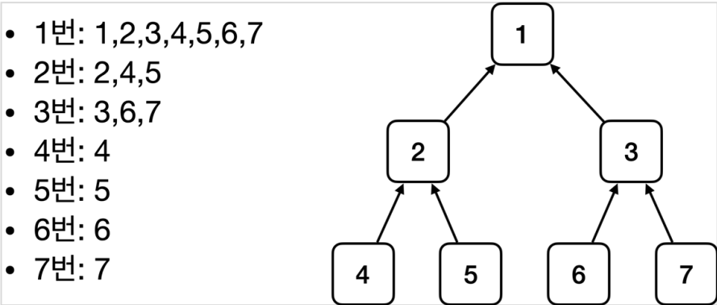
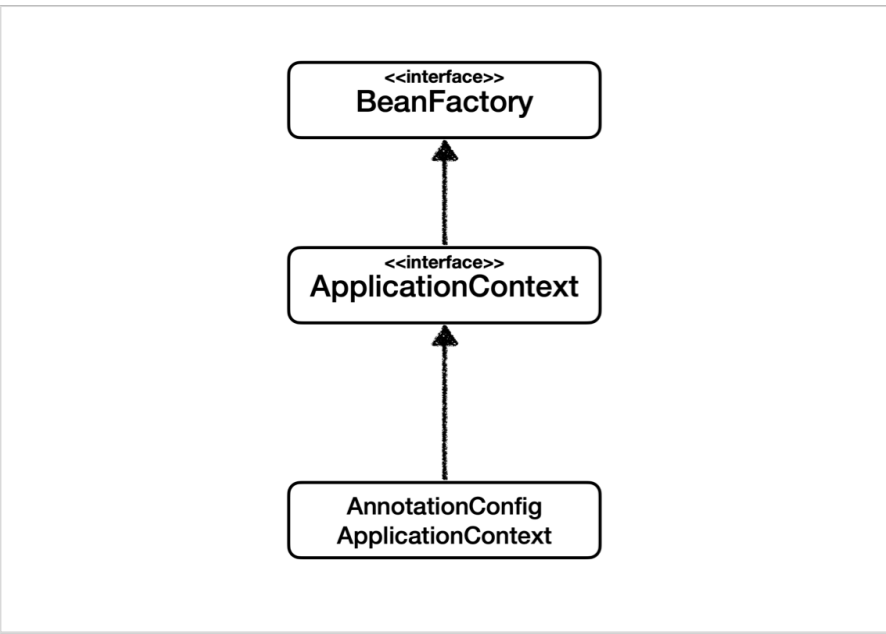
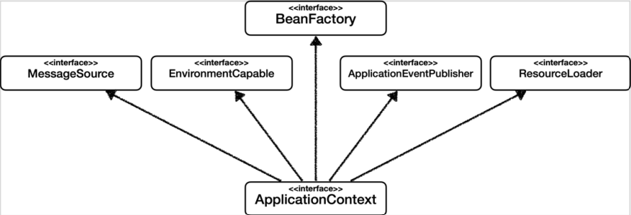
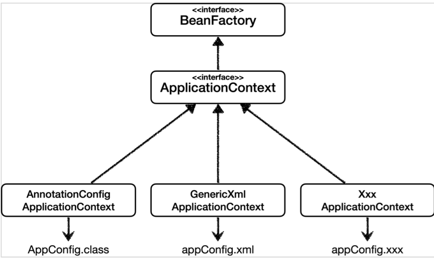
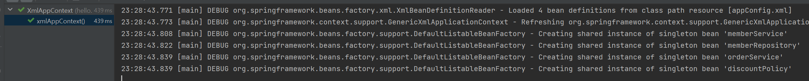
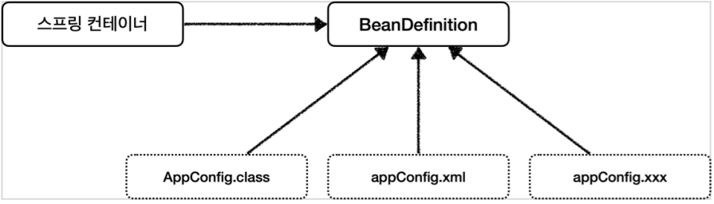
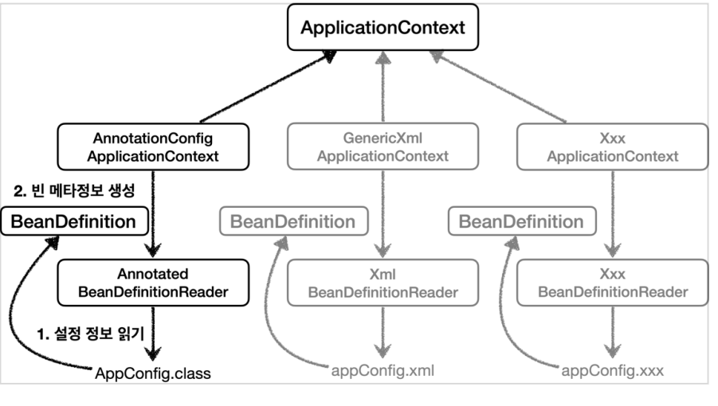

# 1. 스프링 컨테이너 생성
- 컨테이너 = 사용하는 객체들을 전부 담고 있는 곳이라고 이해하기
- ApplicationContext를 스프링 컨테이너라고 한다.
- ApplicationContext는 인터페이스이다.
- AppConfig를 사용했던 방식이 애노테이션 기반의 자바 설정 클래스로 스프링 컨테이너를 만든 것 ! → AnnotationConfigApplication()
- AnnotationConfigApplication() 클래스는 ApplicationContext 인터페이스의 구현체이다.
- **[참고]**   
스프링 컨테이너는 BeanFactory, ApplicationContext 두 개를 구분해서 이야기하는데, BeanFactory를 직접 사용하는 경우는 드물기때문에 그냥 **ApplicationContext = 스프링 컨테이너** 로 이해하기

## 스프링 컨테이너의 생성과정
- (1) 스프링 컨테이너 생성
    - 1-1. new AnnotationConfigApplicationContext(AppConfig.class)
    - 1-2. 스프링 컨테이너를 생성할때는 구성정보(AppConfig.class)를 지정해주어야 함.
    - 1-3. 컨테이너 생성시, 내부에는 스프링 빈 저장소가 생김
    
- (2) 구성정보를 활용하여 스프링 빈 등록
    - 2-1. 구성정보 활용시, 스프링 컨테이너는 파라미터로 넘어온 설정 클래스 내에 있는 어노테이션을 참고하여 스프링 빈을 등록함.
    - 2-2. **관례상 빈 이름은 메서드 이름을 사용한다.** 빈 이름을 직접부여할 수도 있다. **빈이름은 항상 다른 이름을 부여해야 한다.**
    
- (3) 스프링 빈 동적인 객체 인스턴스 의존관계 설정
    - 3-1. 스프링 컨테이너는 설정 정보를 참고해서 의존관계를 주입(DI)한다.
    - 3-2. 단순히 자바 코드를 호출하는 것 같지만, 차이가 존재. 싱글톤 컨테이너에서 그 차이를 설명.
    
- (4) 참고
    - 스프링은 빈을 생성하고, 의존관계를 주입하는 단계가 나누어져 있다.   
    그런데 지금처럼 자바 코드로 스프링 빈을 등록할 경우에는(AppConfig) 생성자를 호출하면서 의존관계 주입도 한번에 처리된다.
        > 예를 들자면, AppConfig의 memberService()를 호출했으면 return값인 new MemberServiceImpl()또한 호출되면서 파라미터로 담겨있던 AppConfig의 memberRepository() 까지 호출됨

    - 하지만 실제 스프링의 라이프사이클은 빈 생성과 의존관계 주입 단계가 나뉘어져 있으므로, 이후 강의를 통해 자동의존관계 주입을 배우면서 왜 단계가 나뉘어져야 하는지 배울 것임 !

# 2. 컨테이너에 등록된 모든 빈 조회
```
public class ApplicationContextInfoTest {

    AnnotationConfigApplicationContext ac = new AnnotationConfigApplicationContext(AppConfig.class);

    @Test
    @DisplayName("모든 빈 출력하기")
    void findAllBean(){
        String[] beanDefinitionNames = ac.getBeanDefinitionNames(); // 스프링에 등록된 모든 빈 이름 조회해서 String배열에 담기
        for (String beanDefinitionName : beanDefinitionNames) { // 빈 이름 하나씩 꺼내기
            Object bean = ac.getBean(beanDefinitionName); // 빈 이름으로 빈 객체 조회해서 bean변수에 담기
            System.out.println("name = " + beanDefinitionName + " | object = " + bean); // 빈 이름과 빈 객체 조회
        }
    }

    @Test
    @DisplayName("애플리케이션 빈 출력하기")
    void findApplicationBean(){
        String[] beanDefinitionNames = ac.getBeanDefinitionNames(); // 스프링에 등록된 모든 빈 이름 조회해서 String배열에 담기
        for (String beanDefinitionName : beanDefinitionNames) { // 빈 이름 하나씩 꺼내기
            BeanDefinition beanDefinition = ac.getBeanDefinition(beanDefinitionName); // 해당 이름을 가진 빈의 메타데이터 정보를 beanDefinition에 담기

            // ROLE_APPLICATION : 직접 등록한 애플리케이션 빈 (스프링 내부에서 필요로하여 등록한 빈이 아니라 애플리케이션을 개발하며 등록한 빈)
            // ROLE_INFRASTRUCTURE : 스프링이 내부에서 사용하는 빈
            if(beanDefinition.getRole() == BeanDefinition.ROLE_APPLICATION){ // 해당 빈의 Role이 ROLE_APPLICATION인지 확인
                Object bean = ac.getBean(beanDefinitionName);
                System.out.println("name = " + beanDefinitionName + " | object = " + bean);
            }
        }
    }
}
```
- 모든 빈 출력하기
    - 실행하면 스프링에 등록된 모든 빈 정보를 출력할 수 있다.
    - ac.getBeanDefinitionNames() : 스프링에 등록된 모든 빈 이름을 조회한다.
    - ac.getBean() : 빈 이름으로 빈 객체(인스턴스)를 조회한다.
- 애플리케이션 빈 출력하기
    - ac.getBeamDefinition() : 빈 메타데이터 정보
    - 스프링이 내부에서 사용하는 빈은 제외하고, 내가 등록한 빈만 출력.
    - 스프링이 내부에서 사용하는 빈은 getRole()로 구분할 수 있다.
        - ROLE_APPLICATION : 일반적으로 사용자가 정의한 빈
        - ROLE_INFRASTRUCTURE : 스프링이 내부에서 사용하는 빈

# 3. 스프링 빈 조회 : 기본
## (1) 빈 이름으로 조회하기
```
public class ApplicationContextBasicFindTest {

    AnnotationConfigApplicationContext ac = new AnnotationConfigApplicationContext(AppConfig.class);
    
    @Test
    @DisplayName("빈 이름으로 조회")
    void findBeanByName(){
        // MemberService.class처럼 인터페이스를 조회하면 해당 인터페이스의 구현체를 대상으로 조회
        MemberService memberService = ac.getBean("memberService", MemberService.class);
        
        // 검증은 Assertions로 하면 됨
        assertThat(memberService).isInstanceOf(MemberServiceImpl.class);
    }
}
```
- 앞서 AppConfig에서 memberService()메소드를 @Bean을 이용해 빈으로 등록해두었다.
- 컨테이너에 해당 빈이 등록되어있는지 조회하기 위해선 getBean()을 이용해서 메소드 이름과 반환타입을 함께 적어준다.
- 현재 getBean()내에 반환타입 파라미터 값은 MemberService.class 로, 인터페이스이다. <U>**인터페이스를 반환타입으로 적게 되면, 테스트 실행시 해당 인터페이스의 구현체를 대상으로 조회한다.**</U>

## (2) 이름 없이 타입으로만 조회
```
public class ApplicationContextBasicFindTest {

    AnnotationConfigApplicationContext ac = new AnnotationConfigApplicationContext(AppConfig.class);
    
    @Test
    @DisplayName("이름 없이 타입으로만 조회")
    void findBeanByType(){
        MemberService memberService = ac.getBean(MemberService.class);

        // 검증은 Assertions로 하면 됨
        assertThat(memberService).isInstanceOf(MemberServiceImpl.class);
    }
}
```
- 스프링 컨테이너에서 스프링 빈을 찾는 가장 기본적인 조회방법으로는 아래와 같이 두가지가 있다.
    - ac.getBean(빈이름, 타입)
    - <U>ac.getBean(타입)</U>
- 이렇게 타입만으로도 빈 조회가 가능하다. 단, 컨테이너에 동일한 타입의 빈이 여러개 등록되어있을때 문제가 발생한다. 그것은 다음 챕터에서 공부!

## (3) 구체적인 타입으로 조회
- 현재까지 getBean() 파라미터에 반환타입을 MemberService.class 인터페이스로 작성했다.
- 이전에 타입으로만 빈 조회가 가능한 것을 배웠으니, MemberService의 구현체인 MemberServiceImpl을 이용하여 빈 조회를 해본다.
```
public class ApplicationContextBasicFindTest {

    AnnotationConfigApplicationContext ac = new AnnotationConfigApplicationContext(AppConfig.class);
    
    @Test
    @DisplayName("구체 타입으로 조회")
    void findBeanBy2(){
        MemberServiceImpl memberService = ac.getBean("memberService", MemberServiceImpl.class);

        // 검증은 Assertions로
        assertThat(memberService).isInstanceOf(MemberServiceImpl.class);
    }
}
```
> MemberServiceImpl memberService = ac.getBean("memberService", MemberServiceImpl.class);
- 스프링은 컨테이너에 빈을 생성할때 메소드의 이름과 반환타입을 컨테이너에 저장하는데,
- 앞서 작성해둔 AppConfig에 memberService()를 보면 메소드 이름은 memberService이고, 반환타입은 MemberServiceImpl이므로 MemberServiceImpl이 스프링 컨테이너에 빈으로 등록되어 있음을 알 수 있다.
- 이렇게 빈에 등록되어있는 객체라면 그것이 구현체일지라도 해당 구현체를 이용해서 빈을 검색할 수 있다.
- **하지만 이것은 좋은 방법은 아니다.(역할과 구현 구분, 역할에 의존하기! 하지만 해당 방식은 구현에 의존하게 됨)** 이런 이유로 해당 구현체의 상위 타입인 인터페이스(MemberService.class)를 사용해왔던 것!
- 이러한 방식은 <U>**컨테이너에 등록된 객체라면 빈 조회에 이용할 수 있다는 점만 알아두고**</U> 혹시나 필요한 경우가 생겼을때만 사용하기! 

## (4) 실패 테스트, 없는 빈이름으로 조회하기
- 우선, 존재하지 않는 빈을 조회하면 어떻게 될까?
```
public class ApplicationContextBasicFindTest {

    AnnotationConfigApplicationContext ac = new AnnotationConfigApplicationContext(AppConfig.class);

    MemberService xxxxx = ac.getBean("xxxxx", MemberService.class);
}
```
- 테스트를 실행하면 존재하지 않는 빈을 조회했으므로 테스트 자체가 실패됨.
- NoSuchBeanDefinitionException 발생


- 그럼 테스트가 실패하지 않도록 테스트 로직으로 검증하는 법을 알아보자
- 이 테스트에선 예외가 터져야 테스트 성공, 그렇지 않으면 테스트 실패!
```
public class ApplicationContextBasicFindTest {

    AnnotationConfigApplicationContext ac = new AnnotationConfigApplicationContext(AppConfig.class);

    assertThrows(NoSuchBeanDefinitionException.class, // (2) 해당 예외가 터져야 한다.
                () -> ac.getBean("xxxxx", MemberService.class)); // (1) 이 람다식을 실행하면
}
```
- 어떤 예외가 발생하는지를 테스트하기 위해선 위와 같은 코드를 사용하면 된다.

# 4. 스프링 빈 조회 : 동일한 타입이 둘 이상
- 타입으로 조회 시 같은 타입의 스프링 빈이 둘 이상이면 오류가 발생한다. 이때는 빈 이름을 함께 지정해줘야한다.
- 우선 현재 AppConfig에는 중복되는 동일한 타입의 메서드가 없으므로, 테스트를 위한 임시클래스 하나를 생성한다.
    - 임시클래스 생성후 AnnotationConfigApplicationContext를 생성할때, 임시로 생성한 클래스명을 파라미터 정보로 입력해줘야 한다.
    - <U>**class 안에 class를 쓸 경우에는 static키워드로 해당 클래스에서만 사용할 클래스임을 명시하기!**</U>
```
public class ApplicationContextSameBeanFindTest {
    AnnotationConfigApplicationContext ac = new AnnotationConfigApplicationContext(SameBeanConfig.class);

    @Configuration
    static class SameBeanConfig{
        @Bean
        public MemberRepository memberRepostiory1(){
            return new MemoryMemberRepository();
        }

        @Bean
        public MemberRepository memberRepository2(){
            return new MemoryMemberRepository();
        }
    }
}
```

## (1) 타입으로 조회 시 같은 타입이 둘 이상 있으면, 중복오류 발생
```
public class ApplicationContextSameBeanFindTest {

    AnnotationConfigApplicationContext ac = new AnnotationConfigApplicationContext(SameBeanConfig.class);

    @Test
    @DisplayName("타입으로 조회시 같은 타입이 둘 이상 있으면, 중복 오류가 발생한다.")
    void findBeanByTypeDuplicate(){
        MemberRepository bean = ac.getBean(MemberRepository.class);
    }
}
```
- 에러발생
> org.springframework.beans.factory.NoUniqueBeanDefinitionException: No qualifying bean of type 'hello.core.member.MemberRepository' available: expected single matching bean but found 2: memberRepository1,memberRepository2
- 코드수정
    - 검증할 내용 : ac.getBean(MemberRepository.class) 을 조회하면, NoUniqueBeanDefinitionException 이 발생할 것이다. 
```
public class ApplicationContextSameBeanFindTest {

    AnnotationConfigApplicationContext ac = new AnnotationConfigApplicationContext(SameBeanConfig.class);

    @Test
    @DisplayName("타입으로 조회시 같은 타입이 둘 이상 있으면, 중복 오류가 발생한다.")
    void findBeanByTypeDuplicate(){
        Assertions.assertThrows(NoUniqueBeanDefinitionException.class,
                    () -> ac.getBean(MemberRepository.class));
    }
}
```

## (2) 타입으로 조회 시 같은 타입이 둘 이상 있으면, 빈 이름을 지정하면 된다.
```
public class ApplicationContextSameBeanFindTest {

    AnnotationConfigApplicationContext ac = new AnnotationConfigApplicationContext(SameBeanConfig.class);

    @Test
    @DisplayName("타입으로 조회시 같은 타입이 둘 이상 있으면, 빈 이름을 지정하면 된다.")
    void findBeanByName(){
        MemberRepository memberRepository = ac.getBean("memberRepository1", MemberRepository.class);
        assertThat(memberRepository).isInstanceOf(MemberRepository.class);
    }
}
```
- memberRepository1 이라는 구체적인 빈 이름을 지정해주면 에러가 발생하지 않는다.

## (3) 특정 타입의 모든 빈을 조회하기
- ac.getBeansOfType()을 사용하면 해당 타입의 모든 빈을 조회할 수 있다.
```
public class ApplicationContextSameBeanFindTest {
    AnnotationConfigApplicationContext ac = new AnnotationConfigApplicationContext(SameBeanConfig.class);

    @Test
    @DisplayName("특정 타입의 모든 빈 조회하기")
    void findAllBeanByType(){
        Map<String, MemberRepository> beansOfType = ac.getBeansOfType(MemberRepository.class);
        for (String key : beansOfType.keySet()) {
            System.out.println("key = " + key + " | value = " + beansOfType.get(key));
        }
        System.out.println("beansOfType = " + beansOfType);
        org.assertj.core.api.Assertions.assertThat(beansOfType.size()).isEqualTo(2);
    }
}
```

# 5. 스프링 빈 조회 : 상속 관계
- 부모타입으로 조회하면, 자식 타입도 함께 조회된다.
- 그래서 모든 자바 객체의 최고 부모인 Object타입으로 조회하면, 모든 스프링 빈을 조회한다.


    ```
    public class ApplicationContextExtendsFindTest {

        AnnotationConfigApplicationContext ac = new AnnotationConfigApplicationContext(TestConfig.class);

        @Test
        @DisplayName("부모 타입으로 조회시 자식이 둘 이상 있으면, 중복오류가 발생한다.")
        void findBeanByParentTypeDuplicate(){
    //        DiscountPolicy bean = ac.getBean(DiscountPolicy.class);
            assertThrows(NoUniqueBeanDefinitionException.class,
                    () -> ac.getBean(DiscountPolicy.class));
        }
        @Test
        @DisplayName("부모 타입으로 조회시 자식이 둘 이상 있으면, 빈 이름으로 지정하면 된다.")
        void findBeanByParentTypeBeanName(){
            DiscountPolicy rateDiscountPolicy = ac.getBean("rateDiscountPolicy", DiscountPolicy.class);
            assertThat(rateDiscountPolicy).isInstanceOf(RateDiscountPolicy.class);
        }
        
        @Test
        @DisplayName("특정 하위 타입으로 조회 물론 안좋은 방법 ㅎ")
        void findBeanBySubType(){
            RateDiscountPolicy bean = ac.getBean(RateDiscountPolicy.class);
            assertThat(bean).isInstanceOf(RateDiscountPolicy.class);
        }

        // 실제 현업에서는 println등으로 출력하는 일이 매우 드물다.
        // 테스트 통과/실패를 시스템이 결정하도록 해야하기에 눈으로 보고 확인할 수 없기 때문.
        // 테스트가 통과하는지 아닌지만 확인하면 되고 출력문은 별 필요가 없음.
        @Test
        @DisplayName("부모 타입으로 모두 조회하기")
        void findAllBeanByParentType(){
            Map<String, DiscountPolicy> beansOfType = ac.getBeansOfType(DiscountPolicy.class);
            assertThat(beansOfType.size()).isEqualTo(2);
            for (String key : beansOfType.keySet()) {
                System.out.println("key = " + key + " | value = " + beansOfType.get(key));
            }
        }

        // 스프링 내부적으로 쓰이는 빈까지 모두 출력
        // 자바객체는 모두 Object타입이기 때문
        @Test
        @DisplayName("부모 타입으로 모두 조회하기 - Object")
        void findAllBeanByObjectType(){
            Map<String, Object> beansOfType = ac.getBeansOfType(Object.class);
            for (String key : beansOfType.keySet()) {
                System.out.println("key = " + key + " | value = " + beansOfType.get(key));
            }
        }

        @Configuration
        static class TestConfig{
            @Bean
            public DiscountPolicy rateDiscountPolicy(){
                return new RateDiscountPolicy();
            }

            @Bean
            public DiscountPolicy fixDiscountPolicy(){
                return new FixDiscountPolicy();
            }
        }
    }

    ```

# 6. BeanFactory와 ApplicationContext


## (1) BeanFactory
- 스프링 컨테이너의 최상위 인터페이스
- 스프링 빈을 관리하고 조회하는 역할 담당 (ex) getBean()
- 지금까지 사용한 대부분의 기능은 BeanFactory가 제공하는 기능

## (2) ApplicationContext
- BeanFactory 기능을 모두 상속받아서 제공
- 빈을 관리하고 검색하는 기능을 BeanFactory가 제공해주는데 그렇다면 둘의 차이는 ? 
    - 애플리케이션 개발에는 빈을 관리하고 조회하는 기능은 물론이고, 수 많은 부가기능이 필요함.
    
    - 메시지 소스를 활용한 국제화 기능
        - (ex) 한국에서 들어가면 한국어로, 영어권에서 들어가면 영어로 출력되는 웹사이트 → 국제화 기능
        - 파일별로 제공언어 관리
    - 환경변수
        - 개발할때 환경 3가지 : 로컬, 테스트서버 개발환경, 실제 프로덕션에 나가는 운영환경
        - 각 환경별로 어떤 데이터베이스를 이용해야할지.. 등 환경변수와 관련된 정보를 처리해주는 기능
    - 애플리케이션 이벤트
        - 이벤트를 발행하고 구독하는 모델을 편리하게 지원
    - 편리한 리소스 조회
        - 파일, 클래스패스, 외부 URL 등에서 리소스를 조회하여 내부에서 사용할때, 이것을 추상화하여 편리하게 사용할 수 있도록 지원
> [정리]   
1. ApplicationContext는 BeanFactory의 기능을 상속받는다.   
2. ApplicationContext는 빈 관리기능 + 편리한 부가 기능을 제공한다.  
3. BeanFactory를 직접 사용할 일은 거의 없다. 부가기능이 포함된 ApplicationContext를 사용한다.
4. BeanFactory나 ApplicationContext를 스프링 컨테이너라고 한다.

# 7. 다양한 설정 형식 지원 : 자바코드, XML
## 스프링의 다양한 설정 방식
- 스프링 컨테이너는 다양한 형식의 설정 정보를 받아드릴 수 있게 유연하게 설계되어 있음.


- **1. AnnotationConfig AplicationContext**
    - 지금까지 사용한 방식
    - new AnnotationConfigApplicationContext(AppConfig.class)
    - AnnotationConfigApplicationContext 클래스를 사용하면서 자바 코드로 된 설정정보를 넘기면 됨.
- **2. GenericXml ApplicationContext**
    - 스프링 부트의 등장으로 잘 사용하지 않는 방식
    - 자바코드가 아니라 xml문서를 설정정보로 사용함
    - 아직 많은 레거시 프로젝트들이 xml로 되어있고, 또 xml을 사용하면 빈 설정 정보를 컴파일 없이 변경할 수 있다는 장점도 있으므로 한번은 배워보기
    - GenericXmlApplicationContext를 사용하며 xml설정파일을 넘기면 됨.
- **3. Xxx ApplicationContext**
    - 임의로 직접 구현한 내용을 설정정보로 사용

## XML 설정사용
> src/main/resources/appConfig.xml
```
<?xml version="1.0" encoding="UTF-8"?>
<beans xmlns="http://www.springframework.org/schema/beans"
       xmlns:xsi="http://www.w3.org/2001/XMLSchema-instance"
       xsi:schemaLocation="http://www.springframework.org/schema/beans http://www.springframework.org/schema/beans/spring-beans.xsd">

        <bean id="memberService" class="hello.core.member.MemberServiceImpl">
            <constructor-arg name="memberRepository" ref="memberRepository" />
        </bean>

        <bean id="memberRepository" class="hello.core.member.MemoryMemberRepository"></bean>

        <bean id="orderService" class="hello.core.order.OrderServiceImpl">
            <constructor-arg name="memberRepository" ref="memberRepository"/>
            <constructor-arg name="discountPolicy" ref="discountPolicy"/>
        </bean>

        <bean id="discountPolicy" class="hello.core.discount.RateDiscountPolicy"></bean>
</beans>
```
> AppConfig와 비교하면 동일한 내용임을 알 수 있음
```
@Configuration
public class AppConfig {

    @Bean
    public MemberService memberService(){
        return new MemberServiceImpl(memberRepository());
    }
    @Bean
    public OrderService orderService(){
        return new OrderServiceImpl(memberRepository(), discountPolicy());
    }
    @Bean
    public MemberRepository memberRepository(){
        return new MemoryMemberRepository();
    }
    @Bean
    public DiscountPolicy discountPolicy(){
        return new RateDiscountPolicy();
    }
}
```

## 테스트
```
public class XmlAppContext {

    @Test
    void xmlAppContext(){
        ApplicationContext ac = new GenericXmlApplicationContext("appConfig.xml");
        MemberService memberService = ac.getBean("memberService", MemberService.class);
        Assertions.assertThat(memberService).isInstanceOf(MemberService.class);
    }
}
```
- 테스트 결과는 성공
- appConfig.xml을 설정정보로 사용하면서 appConfig.xml에 설정한 빈들이 등록되는 것을 확인할 수 있다.


## 결론
- 스프링이 얼마나 유연하고 다양하게 설정 형식을 지원하는지를 알기 위한 학습이었음.
- [참고] https://spring.io/projects/spring-framework


# 8. 스프링 빈 설정 메타 정보 : BeanDefinition
- 스프링이 다양한 설정 형식을 지원할 수 있는 이유 : BeanDefinition이라는 추상화
- 쉽게 이야기해서 역할과 구현을 개념적으로 나눈 것
    - XML을 읽어서 BeanDefinition을 만들면 된다!
    - 자바 코드를 읽어서 BeanDefinition을 만들면 된다!
    - 스프링 컨테이너는 자바 코드인지, XML인지 몰라도 됨. 오직 BeanDefinition만 알면 됨.
    - 스프링 컨테이너는 BeanDefinition(인터페이스)에만 의존한다. BeanDefinition이 class로 설정된 정보인지, xml로 설정된 정보인지는 알지 못한다. => 스프링 컨테이너는 추상화에만 의존하도록 설계되어 있다.
- BeanDefinition을 빈 설정 메타정보라고 한다.
    - @Bean, < bean > 당 각각 하나씩 메타정보가 생성된다.
- 스프링 컨테이너는 이 메타정보를 기반으로 스프링 빈을 생성한다.



- AnnotationConfigApplicationContext는 AnnotatedBeanDefinitionReader를 사용해서 AppConfig.class를 읽고 BeanDefinition을 생성한다.
- GenericXmlApplicationContext는 XmlBeanDefinitionReader를 사용해서 appConfig.xml 설정 정보를 읽고 BeanDefinition을 생성한다.
- 새로운 형식의 설정 정보가 추가되면, XxxBeanDefinitionReader를 만들어서 BeanDefinition을 생성하면 된다.

## BeanDefinition 살펴보기
```
public class BeanDefinitionTest {

    AnnotationConfigApplicationContext ac = new AnnotationConfigApplicationContext(AppConfig.class);
//    GenericXmlApplicationContext ac = new GenericXmlApplicationContext("appConfig.xml");
    @Test
    @DisplayName("빈 설정 메타정보 확인")
    void findApplicationBean(){
        String[] beanDefinitionNames = ac.getBeanDefinitionNames();
        for (String beanDefinitionName : beanDefinitionNames) {
            BeanDefinition beanDefinition = ac.getBeanDefinition(beanDefinitionName);

            if(beanDefinition.getRole() == BeanDefinition.ROLE_APPLICATION){
                System.out.println("beanDefinition = " + beanDefinitionName
                        + " | beanDefinition = " + beanDefinition);
            }
        }
    }
}
```
- AppConfig.class 사용
    > beanDefinition = memberService | beanDefinition = Root bean: class [null]; scope=; abstract=false; lazyInit=null; autowireMode=3; dependencyCheck=0; autowireCandidate=true; primary=false; factoryBeanName=appConfig; factoryMethodName=memberService; initMethodName=null; destroyMethodName=(inferred); defined in hello.core.AppConfig

- appConfig.xml 사용
    > beanDefinition = memberService | beanDefinition = Generic bean: class [hello.core.member.MemberServiceImpl]; scope=; abstract=false; lazyInit=false; autowireMode=0; dependencyCheck=0; autowireCandidate=true; primary=false; factoryBeanName=null; factoryMethodName=null; initMethodName=null; destroyMethodName=null; defined in class path resource [appConfig.xml]

- BeanDefinition 정보
    - BeanClassName 
        - 생성할 빈의 클래스 명
        - 자바설정(AppConfig.class)처럼 팩토리 역할의 빈을 사용하면 null로 표시됨
        - 예 ) <U>**beanDefinition = Root bean: class [null];**</U>
    - factoryBeanName
        - 팩토리 역할의 빈을 사용할 경우 이름
        - **팩토리**역할의 빈이므로 appConfig.xml을 사용한 BeanDefinition 내용을 보면 factoryBeanName값이 null임
        - 예 ) appConfig
    - factoryMethodName
        - 빈을 생성할 팩토리 메서드 지정
        - 예 ) memberService
    - Scope
        - 싱글톤(기본값)
    - IazyInit
        - 스프링 컨테이너를 생성할 때 빈을 생성하는 것이 아니라, 실제 빈을 사용할때까지 최대한 생성을 지연처리 하는지 여부
    - InitMethodName
        - 빈을 생성하고, 의존관계를 적용한 뒤에 호출되는 초기화 메서드 명
    - DestroyMethodName
        - 빈의 생명주기가 끝나서 제거하기 직전에 호출되는 메서드 명
    - Constructor arguments, Properties
        - 의존관계 주입에서 사용
        - 자바설정(AppConfig.class)처럼 팩토리 역할의 빈을 사용하면 없음.