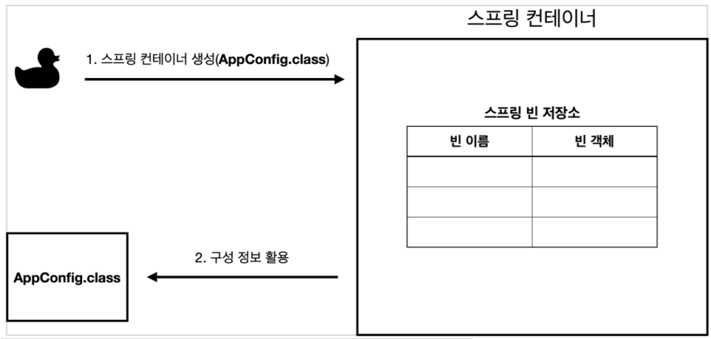
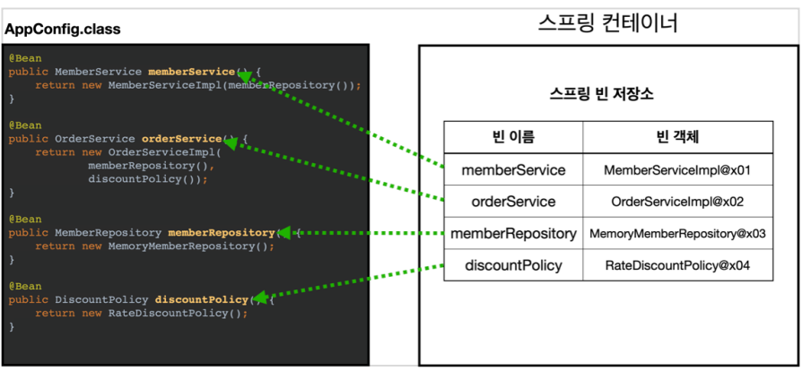
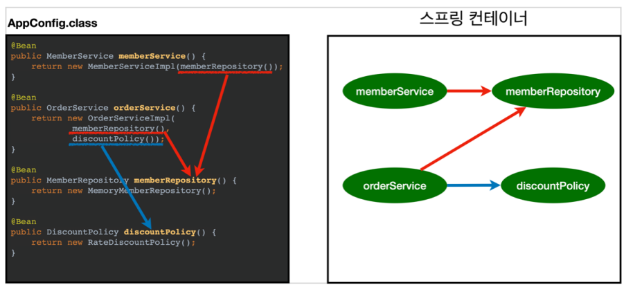
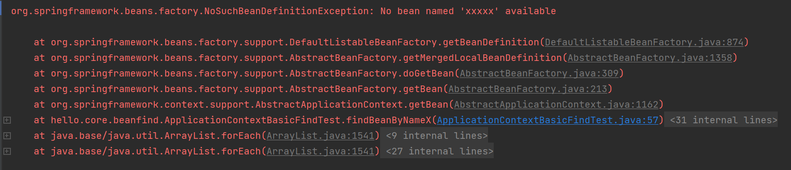

# 1. 스프링 컨테이너 생성
- 컨테이너 = 사용하는 객체들을 전부 담고 있는 곳이라고 이해하기
- ApplicationContext를 스프링 컨테이너라고 한다.
- ApplicationContext는 인터페이스이다.
- AppConfig를 사용했던 방식이 애노테이션 기반의 자바 설정 클래스로 스프링 컨테이너를 만든 것 ! → AnnotationConfigApplication()
- AnnotationConfigApplication() 클래스는 ApplicationContext 인터페이스의 구현체이다.
- **[참고]**   
스프링 컨테이너는 BeanFactory, ApplicationContext 두 개를 구분해서 이야기하는데, BeanFactory를 직접 사용하는 경우는 드물기때문에 그냥 **ApplicationContext = 스프링 컨테이너** 로 이해하기

## 스프링 컨테이너의 생성과정
- (1) 스프링 컨테이너 생성
    - 1-1. new AnnotationConfigApplicationContext(AppConfig.class)
    - 1-2. 스프링 컨테이너를 생성할때는 구성정보(AppConfig.class)를 지정해주어야 함.
    - 1-3. 컨테이너 생성시, 내부에는 스프링 빈 저장소가 생김
    
- (2) 구성정보를 활용하여 스프링 빈 등록
    - 2-1. 구성정보 활용시, 스프링 컨테이너는 파라미터로 넘어온 설정 클래스 내에 있는 어노테이션을 참고하여 스프링 빈을 등록함.
    - 2-2. **관례상 빈 이름은 메서드 이름을 사용한다.** 빈 이름을 직접부여할 수도 있다. **빈이름은 항상 다른 이름을 부여해야 한다.**
    
- (3) 스프링 빈 동적인 객체 인스턴스 의존관계 설정
    - 3-1. 스프링 컨테이너는 설정 정보를 참고해서 의존관계를 주입(DI)한다.
    - 3-2. 단순히 자바 코드를 호출하는 것 같지만, 차이가 존재. 싱글톤 컨테이너에서 그 차이를 설명.
    
- (4) 참고
    - 스프링은 빈을 생성하고, 의존관계를 주입하는 단계가 나누어져 있다.   
    그런데 지금처럼 자바 코드로 스프링 빈을 등록할 경우에는(AppConfig) 생성자를 호출하면서 의존관계 주입도 한번에 처리된다.
        > 예를 들자면, AppConfig의 memberService()를 호출했으면 return값인 new MemberServiceImpl()또한 호출되면서 파라미터로 담겨있던 AppConfig의 memberRepository() 까지 호출됨

    - 하지만 실제 스프링의 라이프사이클은 빈 생성과 의존관계 주입 단계가 나뉘어져 있으므로, 이후 강의를 통해 자동의존관계 주입을 배우면서 왜 단계가 나뉘어져야 하는지 배울 것임 !

# 2. 컨테이너에 등록된 모든 빈 조회
```
public class ApplicationContextInfoTest {

    AnnotationConfigApplicationContext ac = new AnnotationConfigApplicationContext(AppConfig.class);

    @Test
    @DisplayName("모든 빈 출력하기")
    void findAllBean(){
        String[] beanDefinitionNames = ac.getBeanDefinitionNames(); // 스프링에 등록된 모든 빈 이름 조회해서 String배열에 담기
        for (String beanDefinitionName : beanDefinitionNames) { // 빈 이름 하나씩 꺼내기
            Object bean = ac.getBean(beanDefinitionName); // 빈 이름으로 빈 객체 조회해서 bean변수에 담기
            System.out.println("name = " + beanDefinitionName + " | object = " + bean); // 빈 이름과 빈 객체 조회
        }
    }

    @Test
    @DisplayName("애플리케이션 빈 출력하기")
    void findApplicationBean(){
        String[] beanDefinitionNames = ac.getBeanDefinitionNames(); // 스프링에 등록된 모든 빈 이름 조회해서 String배열에 담기
        for (String beanDefinitionName : beanDefinitionNames) { // 빈 이름 하나씩 꺼내기
            BeanDefinition beanDefinition = ac.getBeanDefinition(beanDefinitionName); // 해당 이름을 가진 빈의 메타데이터 정보를 beanDefinition에 담기

            // ROLE_APPLICATION : 직접 등록한 애플리케이션 빈 (스프링 내부에서 필요로하여 등록한 빈이 아니라 애플리케이션을 개발하며 등록한 빈)
            // ROLE_INFRASTRUCTURE : 스프링이 내부에서 사용하는 빈
            if(beanDefinition.getRole() == BeanDefinition.ROLE_APPLICATION){ // 해당 빈의 Role이 ROLE_APPLICATION인지 확인
                Object bean = ac.getBean(beanDefinitionName);
                System.out.println("name = " + beanDefinitionName + " | object = " + bean);
            }
        }
    }
}
```
- 모든 빈 출력하기
    - 실행하면 스프링에 등록된 모든 빈 정보를 출력할 수 있다.
    - ac.getBeanDefinitionNames() : 스프링에 등록된 모든 빈 이름을 조회한다.
    - ac.getBean() : 빈 이름으로 빈 객체(인스턴스)를 조회한다.
- 애플리케이션 빈 출력하기
    - ac.getBeamDefinition() : 빈 메타데이터 정보
    - 스프링이 내부에서 사용하는 빈은 제외하고, 내가 등록한 빈만 출력.
    - 스프링이 내부에서 사용하는 빈은 getRole()로 구분할 수 있다.
        - ROLE_APPLICATION : 일반적으로 사용자가 정의한 빈
        - ROLE_INFRASTRUCTURE : 스프링이 내부에서 사용하는 빈

# 3. 스프링 빈 조회 : 기본
## (1) 빈 이름으로 조회하기
```
public class ApplicationContextBasicFindTest {

    AnnotationConfigApplicationContext ac = new AnnotationConfigApplicationContext(AppConfig.class);
    
    @Test
    @DisplayName("빈 이름으로 조회")
    void findBeanByName(){
        // MemberService.class처럼 인터페이스를 조회하면 해당 인터페이스의 구현체를 대상으로 조회
        MemberService memberService = ac.getBean("memberService", MemberService.class);
        
        // 검증은 Assertions로 하면 됨
        assertThat(memberService).isInstanceOf(MemberServiceImpl.class);
    }
}
```
- 앞서 AppConfig에서 memberService()메소드를 @Bean을 이용해 빈으로 등록해두었다.
- 컨테이너에 해당 빈이 등록되어있는지 조회하기 위해선 getBean을 이용해서 메소드 이름과 반환타입을 함께 적어준다.
- 현재 getBean()내에 반환타입 파라미터 값은 MemberService.class 로, 인터페이스이다. <U>**인터페이스를 반환타입으로 적게 되면, 테스트 실행시 해당 인터페이스의 구현체를 대상으로 조회한다.**</U>

## (2) 이름 없이 타입으로만 조회
```
public class ApplicationContextBasicFindTest {

    AnnotationConfigApplicationContext ac = new AnnotationConfigApplicationContext(AppConfig.class);
    
    @Test
    @DisplayName("이름 없이 타입으로만 조회")
    void findBeanByType(){
        MemberService memberService = ac.getBean(MemberService.class);

        // 검증은 Assertions로 하면 됨
        assertThat(memberService).isInstanceOf(MemberServiceImpl.class);
    }
}
```
- 스프링 컨테이너에서 스프링 빈을 찾는 가장 기본적인 조회방법으로는 아래와 같이 두가지가 있다.
    - ac.getBean(빈이름, 타입)
    - ac.getBean(타입)
- 이렇게 타입만으로도 빈 조회가 가능하다. 단, 컨테이너에 동일한 타입의 빈이 여러개 등록되어있을때 문제가 발생한다. 그것은 다음 챕터에서 공부!

## (3) 구체적인 타입으로 조회
- 현재까지 getBean() 파라미터에 반환타입을 MemberService.class 인터페이스로 작성했다.
- 이전에 타입으로만 빈 조회가 가능한 것을 배웠으니, MemberService의 구현체인 MemberServiceImpl을 이용하여 빈 조회를 해본다.
```
public class ApplicationContextBasicFindTest {

    AnnotationConfigApplicationContext ac = new AnnotationConfigApplicationContext(AppConfig.class);
    
    @Test
    @DisplayName("구체 타입으로 조회")
    void findBeanBy2(){
        MemberServiceImpl memberService = ac.getBean("memberService", MemberServiceImpl.class);

        // 검증은 Assertions로
        assertThat(memberService).isInstanceOf(MemberServiceImpl.class);
    }
}
```
> MemberServiceImpl memberService = ac.getBean("memberService", MemberServiceImpl.class);
- 스프링은 컨테이너에 빈을 생성할때 메소드의 이름과 반환타입을 컨테이너에 저장하는데,
- 앞서 작성해둔 AppConfig에 memberService()를 보면 메소드 이름은 memberService이고, 반환타입은 MemberServiceImpl이므로 MemberServiceImpl이 스프링 컨테이너에 빈으로 등록되어 있음을 알 수 있다.
- 이렇게 빈에 등록되어있는 객체라면 그것이 구현체일지라도 해당 구현체를 이용해서 빈을 검색할 수 있다.
- **하지만 이것은 좋은 방법은 아니다.(역할과 구현 구분, 역할에 의존하기! 하지만 해당 방식은 구현에 의존하게 됨)** 이런 이유로 해당 구현체의 상위 타입인 인터페이스(MemberService.class)를 사용해왔던 것!
- 이러한 방식은 <U>**컨테이너에 등록된 객체라면 빈 조회에 이용할 수 있다는 점만 알아두고**</U> 혹시나 필요한 경우가 생겼을때만 사용하기! 

## (4) 실패 테스트, 없는 빈이름으로 조회하기
- 우선, 존재하지 않는 빈을 조회하면 어떻게 될까?
```
public class ApplicationContextBasicFindTest {

    AnnotationConfigApplicationContext ac = new AnnotationConfigApplicationContext(AppConfig.class);

    MemberService xxxxx = ac.getBean("xxxxx", MemberService.class);
}
```
- 테스트를 실행하면 존재하지 않는 빈을 조회했으므로 테스트 자체가 실패됨.
- NoSuchBeanDefinitionException 발생


- 그럼 테스트가 실패하지 않도록 테스트 로직으로 검증하는 법을 알아보자
- 이 테스트에선 예외가 터져야 테스트 성공, 그렇지 않으면 테스트 실패!
```
public class ApplicationContextBasicFindTest {

    AnnotationConfigApplicationContext ac = new AnnotationConfigApplicationContext(AppConfig.class);

    assertThrows(NoSuchBeanDefinitionException.class, // (2) 해당 예외가 터져야 한다.
                () -> ac.getBean("xxxxx", MemberService.class)); // (1) 이 람다식을 실행하면
}
```
- 어떤 예외가 발생하는지를 테스트하기 위해선 위와 같은 코드를 사용하면 된다.
# 4. 스프링 빈 조회 : 동일한 타입이 둘 이상

# 5. 스프링 빈 조회 : 상속 관계

# 6. BeanFactory와 ApplicationContext

# 7. 다양한 설정 형식 지원 : 자바코드, XML

# 8. 스프링 빈 설정 메타 정보 : BeanDefinition