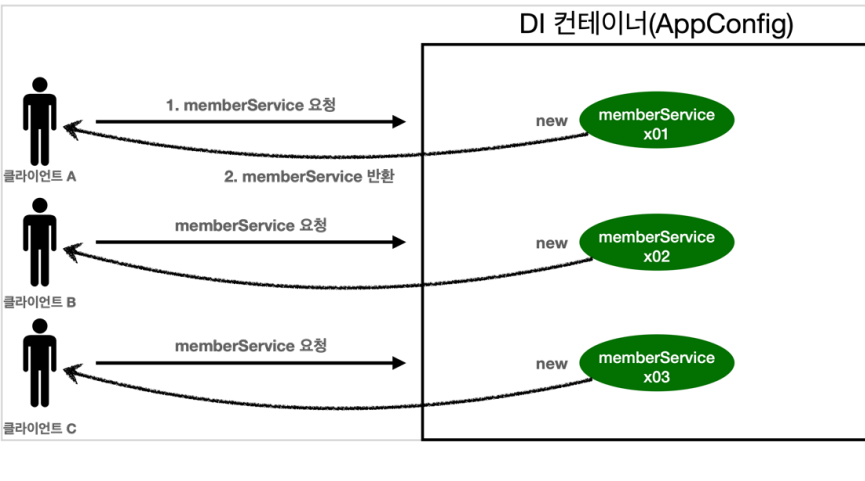
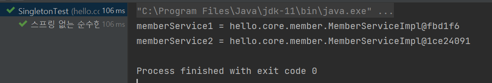

# 1. 웹 애플리케이션과 싱글톤
- 스프링은 태생이 기업용 온라인 서비스 기술을 지원하기 위해 탄생
- 대부분의 스프링 애플리케이션은 웹 애플리케이션이다. 물론 웹이 아닌 애플리케이션 개발도 얼마든지 개발 가능
- 웹 애플리케이션은 보통 여러 고객이 동시에 요청을 한다.

## 현재코드 문제점


```
@Configuration 
public class AppConfig {

    @Bean 
    public MemberService memberService(){
        return new MemberServiceImpl(memberRepository());
    }
    @Bean
    public OrderService orderService(){
        return new OrderServiceImpl(memberRepository(), discountPolicy());
    }
    @Bean
    public MemberRepository memberRepository(){
        return new MemoryMemberRepository();
    }
    @Bean
    public DiscountPolicy discountPolicy(){
        return new RateDiscountPolicy();
    }
}
```

- 현재 구현되어 있는 AppConfig같은 경우, 여러 고객이 동시에 memberService()를 요청하게 되면 각 고객에게 return new MemberServiceImpl(memberRepository())을 반환하면서 요청개수만큼의 객체가 생성이 되며, 각 고객에게 반환된 객체는 서로 다른 객체이다.
- 이것이 주는 문제점은 우선 **요청이 올때마다 계속 새로운 객체를 만들어야 한다는 것.** 또한 웹 애플리케이션은 고객의 요청을 끊임없이 받아야 하는데 이대로라면 **JVM메모리에 객체가 계속해서 생성되어 많은 공간을 차지하게 된다는 것**이다.

## 테스트코드로 검증하기
```
public class SingletonTest {
    
    @Test
    @DisplayName("스프링 없는 순수한 DI 컨테이너")
    void pureContainer(){
        AppConfig appConfig = new AppConfig();
        // 1. 조회 : 호출할때마다 객체를 생성
        MemberService memberService1 = appConfig.memberService();
        
        // 2. 조회 : 호출할때마다 객체를 생성
        MemberService memberService2 = appConfig.memberService();
        
        // 3. 참조값이 다른 것을 확인
        System.out.println("memberService1 = " + memberService1);
        System.out.println("memberService2 = " + memberService2);

        // 4. 검증 memberService1 != memberService2
        // 테스트코드는 3번처럼 눈으로 확인하는 코드가 아니라 자동으로 테스트가 가능한 코드를 작성해야함.
        Assertions.assertThat(memberService1).isNotSameAs(memberService2);
    }
}
```


- 우리가 만들었던 스프링 없는 순수한 DI컨테이너인 AppConfig는 요청을 할 때 마다 객체를 새로 생성한다.
- 고객 트래픽이 초당 100이 나오면 초당 100개 객체가 생성되고 소멸된다. <U>**→ 메모리 낭비가 심하다.**</U>
- 해결방안은 해당 객체가 딱 1개만 생성되고, 공유하도록 설계하면 된다. <U>**→ 싱글톤 패턴**</U>

# 2. 싱글톤 패턴

# 3. 싱글톤 컨테이너

# 4. 싱글톤 방식의 주의점

# 5. @Configuration과 싱글톤

# 6. @Configuration과 바이트코드 조작의 마법
