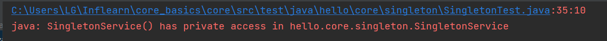

# 1. 웹 애플리케이션과 싱글톤
- 스프링은 태생이 기업용 온라인 서비스 기술을 지원하기 위해 탄생
- 대부분의 스프링 애플리케이션은 웹 애플리케이션이다. 물론 웹이 아닌 애플리케이션 개발도 얼마든지 개발 가능
- 웹 애플리케이션은 보통 여러 고객이 동시에 요청을 한다.

## 현재코드 문제점


```
@Configuration 
public class AppConfig {

    @Bean 
    public MemberService memberService(){
        return new MemberServiceImpl(memberRepository());
    }
    @Bean
    public OrderService orderService(){
        return new OrderServiceImpl(memberRepository(), discountPolicy());
    }
    @Bean
    public MemberRepository memberRepository(){
        return new MemoryMemberRepository();
    }
    @Bean
    public DiscountPolicy discountPolicy(){
        return new RateDiscountPolicy();
    }
}
```

- 현재 구현되어 있는 AppConfig같은 경우, 여러 고객이 동시에 memberService()를 요청하게 되면 각 고객에게 return new MemberServiceImpl(memberRepository())을 반환하면서 요청개수만큼의 객체가 생성이 되며, 각 고객에게 반환된 객체는 서로 다른 객체이다.
- 이것이 주는 문제점은 우선 **요청이 올때마다 계속 새로운 객체를 만들어야 한다는 것.** 또한 웹 애플리케이션은 고객의 요청을 끊임없이 받아야 하는데 이대로라면 **JVM메모리에 객체가 계속해서 생성되어 많은 공간을 차지하게 된다는 것**이다.

## 테스트코드로 검증하기
```
public class SingletonTest {
    
    @Test
    @DisplayName("스프링 없는 순수한 DI 컨테이너")
    void pureContainer(){
        AppConfig appConfig = new AppConfig();
        // 1. 조회 : 호출할때마다 객체를 생성
        MemberService memberService1 = appConfig.memberService();
        
        // 2. 조회 : 호출할때마다 객체를 생성
        MemberService memberService2 = appConfig.memberService();
        
        // 3. 참조값이 다른 것을 확인
        System.out.println("memberService1 = " + memberService1);
        System.out.println("memberService2 = " + memberService2);

        // 4. 검증 memberService1 != memberService2
        // 테스트코드는 3번처럼 눈으로 확인하는 코드가 아니라 자동으로 테스트가 가능한 코드를 작성해야함.
        Assertions.assertThat(memberService1).isNotSameAs(memberService2);
    }
}
```


- 우리가 만들었던 스프링 없는 순수한 DI컨테이너인 AppConfig는 요청을 할 때 마다 객체를 새로 생성한다.
- 고객 트래픽이 초당 100이 나오면 초당 100개 객체가 생성되고 소멸된다. <U>**→ 메모리 낭비가 심하다.**</U>
- 해결방안은 해당 객체가 딱 1개만 생성되고, 공유하도록 설계하면 된다. <U>**→ 싱글톤 패턴**</U>

# 2. 싱글톤 패턴
- 객체 인스턴스가 현재 자바 JVM안에 단 하나만 있어야 하는 패턴
- 한 JVM(자바서버)안에서는 객체 인스턴스가 딱 하나만 생성되도록 보장하는 패턴. 동일한 객체 인스턴스가 2개 이상 생성될 수는 없음
- 클래스의 인스턴스가 딱 1개만 생성되는 것을 보장하는 디자인 패턴
- 그래서 객체 인스턴스를 2개이상 생성하지 못하도록 막아야 한다
    - private 생성자를 사용해서 외부에서 임의로 new 키워드를 사용하지 못하도록 막아야 한다.

## 싱글톤 패턴 적용하기
```
public class SingletonService {

    // 자기자신을 내부에 private으로 가짐 + static이므로 클래스 레벨에 올라가기때문에 딱 하나만 존재하게됨.
    private static final SingletonService instance = new SingletonService();

    // 사용방법
    public static SingletonService getInstance(){
        return instance;
    }
    
    // 밖에서 new SingletonService로 해당 객체를 생성하지 못하도록 기본 생성자 만들기 *private 으로*
    private SingletonService(){

    }

    public void logic(){
        System.out.println("싱긅톤 객체 로직 호출");
    }

    // 애플리케이션 실행시 동작순서
    // 1. 우선 애플리케이션이 실행되면서 SingletonService의 static영역에 new SingletonService()를 실행하여 해당 객체를 생성한 후 변수 instance에 참조를 걸어둠
    // 2. 즉 SingletonService 객체는 현재 static영역에 단 하나만 존재함.
    // 3. instance변수에 담긴 SingletonService객체에 대한 참조값을 사용할 수 있는 방법은 오롯이 getInstance() 이다.
    // 4. 또한 SingletonService를 생성할 수 있는 방법은 전혀 없음. (이미 기본생성자가 있는데 그게 private이므로)
}
```
- 1. static영역에 객체 instance를 미리 하나 생성해서 올려둔다.
- 2. 이 객체 인스턴스가 필요하면 오직 getInstance()메서드를 통해서만 조회할 수 있다. 이 메서드를 호출하면 항상 같은 인스턴스를 반환한다.
- 3. 딱 1개의 객체 인스턴스만 존재해야 하므로, 생성자를 private으로 막아서 혹시라도 외부에서 new키워드로 객체 인스턴스가 생성되는 것을 막는다.

## 테스트코드로 검증하기
```
@Test
    @DisplayName("싱글톤 패턴을 적용한 객체 사용해보기")
    void singletoneServiceTest(){
        new SingletonService(); // -> 컴파일오류발생 : private access
    }
```


- private으로 new키워드가 막힌것을 확인할 수 있음. → 컴파일오류발생
    - 가장 좋은 오류는 컴파일 오류! 컴파일 오류만으로 대부분의 오류가 다 잡히도록 설계하는 것이 잘 설계했다는 증거가 되기도 !

```
@Test
    @DisplayName("싱글톤 패턴을 적용한 객체 사용해보기")
    void singletoneServiceTest(){
        // new SingletonService(); -> 컴파일오류발생 : private access

        // 호출할때마다 새로운 객체 생성?
        SingletonService singletonService1 = SingletonService.getInstance();
        SingletonService singletonService2 = SingletonService.getInstance();

        // 참조값 확인
        System.out.println("singletonService1 = " + singletonService1);
        System.out.println("singletonService2 = " + singletonService2);
        
        // 싱글톤 패턴을 적용한 객체이므로, 자바가 뜰때 static으로 이미 생성해둔 객체를 가져다 쓰는 것임
        // 그래서 호출할때마다 새로운 객체를 생성하는 것이 아니라, 이미 만들어둔 객체를 여기저기다 가져다 쓰는 것이므로 서로 동일한 객체임

        // 검증
        // same 와 equal 차이점 알기
        assertThat(singletonService1).isSameAs(singletonService2);
    }
```


- 호출할때마다 같은 객체 인스턴스를 반환하는 것 또한 확인가능.

## 싱글톤패턴 문제점
- 싱글톤 패턴을 적용하면 고객의 요청이 올 때마다 객체를 생성하는 것이 아니라, 이미 만들어진 객체를 공유해서 효율적으로 사용할 수 있다. 하지만 싱글톤 패턴은 다음과 같은 문제점을 가지고 있다.
    - 싱글톤 패턴을 구현하는 코드 자체가 많이 들어감
    - 의존관계상 클라이언트가 구체 클래스에 의존한다. (ex) 구체클래스.getInstance()
    - 클라이언트가 구체 클래스에 의존해서 OCP원칙을 위반할 가능성이 높다.
    - 테스트하기가 어렵다.
    - 내부 속성을 변경하거나 초기화 하기 어렵다.
    - private 생성자로 자식 클래스를 만들기 어렵다.
    - 결론적으로 유연성이 떨어져 안티패턴으로 불리기도 한다.

## 싱글톤 컨테이너
- 이제 AppConfig에 있는 것들을 전부 싱글톤 패턴으로 만들면 되는건가?
    - 놉 ~! 스프링 컨테이너를 사용하면 스프링 컨테이너가 기본적으로 객체를 전부 다 싱글톤으로 만들어서 관리해줌.
    - 심지어 스프링 프레임워크는 위의 **싱글톤 패턴의 단점을 전부 해결하고** 객체를 싱글톤으로 관리해줌.

# 3. 싱글톤 컨테이너
- 스프링 컨테이너는 싱글톤 패턴의 문제점을 해결하면서, 객체 인스턴스를 싱글톤(1개만 생성)으로 관리한다.
- 지금까지 우리가 학습한 스프링 빈이 바로 싱글톤으로 관리되는 빈!

## 싱글톤 컨테이너
- 스프링 컨테이너는 싱글턴 패턴을 적용하지 않아도 객체 인스턴스를 싱글톤으로 관리
    - 이전에 설명한 컨테이너 생성과정 참고
    - 컨테이너는 객체를 하나만 생성해서 관리함
    
    **1. 컨테이너 생성**
    ```
    ApplicationContext applicationContext = new AnnotationConfigApplicationContext(AppConfig.class);
    ```
    

    **2. 스프링 빈 등록**
    - 구성정보로 설정된 AppConfig.class를 참고해서 스프링 빈 등록을 완료한 컨테이너
    - 이제 요청이 들어오면 컨테이너는 새로운 객체 인스턴스를 생성하는 것이 아니라, 이미 빈으로 등록되어 있는 객체들을 이용, 싱글톤으로 관리할 것이다.
    
- 스프링 컨테이너는 싱글톤 컨테이너 역할을 한다. 이렇게 싱글톤 객체를 생성하고 관리하는 기능을 싱글톤 레지스트리라고 한다.
- 스프링 컨테이너의 이런 기능 덕분에 싱글턴 패턴의 모든 단점을 해결하면서 객체를 싱글톤으로 유지할 수 있다.
    - 싱글톤 패턴을 위한 지저분한 코드가 들어가지 않아도 된다.
    - DIP, OCP, 테스트, private 생성자로부터 자유롭게 싱글톤을 사용할 수 있다.

## 스프링 컨테이너를 사용하는 테스트 코드
```
public class SingletonTest {
    @Test
    @DisplayName("스프링 컨테이너와 싱글톤")
    void springContainer(){

        ApplicationContext ac = new AnnotationConfigApplicationContext(AppConfig.class);

        MemberService memberService1 = ac.getBean("memberService", MemberService.class);
        MemberService memberService2 = ac.getBean("memberService", MemberService.class);

        // 참조값 비교
        System.out.println("memberService1 = " + memberService1);
        System.out.println("memberService2 = " + memberService2);

        // 검증 memberService1 = memberService2
        assertThat(memberService1).isSameAs(memberService2);
    }
}
```


- AppConfig를 구성정보로 갖는 스프링 컨테이너 생성
- 구성정보를 기반으로 스프링 빈 등록되는 것 확인가능
- 참조값 비교해보면 서로 다른 요청이지만 반환된 객체 인스턴스의 참조값은 동일한 것을 알 수 있음

## 싱글톤 컨테이너 적용 전/후
<table>
    <thead>
        <tr>
            <th>Before</th>
            <th>After</th>
        </tr>
    </thead>
    <tbody>
        <tr>
            <td></td>
            <td></td>
        </tr>
        <tr>
            <td>요청건마다 새로운 객체 생성</td>
            <td>서로 다른 요청에도 이미 만들어 둔 동일한 객체를 이용</td>
        </tr>
    </tbody>
</table>

- 스프링 컨테이너 덕분에 고객의 요청이 올 때 마다 객체를 생성하는 것이 아니라, 이미 만들어진 객체를 공유해서 효율적으로 재사용할 수 있다. → 속도가 훨씬 빨라짐

## 참고
- 스프링의 기본 빈 등록 방식은 싱글톤이지만, 싱글톤 방식만 지원하는 것은 아니다. 요청할 때마다 새로운 객체를 생성해서 반환하는 기능도 제공함. (자세한 내용은 빈 스코프에서)

# 4. 싱글톤 방식의 주의점
- 싱글톤 패턴을 사용하든, 스프링 컨테이너를 사용하든 간에, 객체 인스턴스를 하나만 생성해서 공유하는 싱글톤 방식은 여러 클라이언트가 하나의 같은 객체 인스턴스를 공유하기 때문에 싱글톤 객체는 상태를 유지(stateful)하게 설계하면 안된다!
- 무상태(stateless)로 설계해야 한다!
    - 특정 클라이언트에 의존적인 필드가 있으면 안된다
    - 특정 클라이언트가 값을 변경할 수 있는 필드가 있으면 안된다
    - 가급적 읽기만 가능해야 한다 (= 가급적 값을 수정하면 안됨)
    - 필드 대신에 자바에서 공유되지 않는 <U>**지역변수, 파라미터, ThreadLocal**</U>등을 사용해야 한다
- 싱글톤 방식 한정, 스프링 빈의 필드에 공유 값을 설정하면 정말 큰 장애가 발생할 수 있다

## 상태를 유지할 경우 발생하는 문제점 예시
```
public class StatefulService {
    
    private int price; // 상태를 유지하는 필드

    public void order(String name, int price){
        System.out.println("name = " + name + " price = " + price);
        this.price = price; // 여기가 문제!
    }

    public int getPrice(){
        return price;
    }
}
```

```
class StatefulServiceTest {

    @Test
    void statefulServiceSingleton(){
        AnnotationConfigApplicationContext ac = new AnnotationConfigApplicationContext(TestConfig.class);
        StatefulService statefulService1 = ac.getBean(StatefulService.class);
        StatefulService statefulService2 = ac.getBean(StatefulService.class);

        //ThreadA : A사용자 10000원 주문
        statefulService1.order("userA", 10000);
        //ThreadB : B사용자 20000원 주문
        statefulService2.order("userB", 20000);
        
        //ThreadA : A사용자 주문 금액 조회
        int price = statefulService1.getPrice();
        System.out.println("price = " + price);

        //검증코드
        Assertions.assertThat(statefulService1.getPrice()).isEqualTo(20000);
    }

    // 테스트용 설정클래스 만들기
    static class TestConfig {
        @Bean
        public StatefulService statefulService(){
            return new StatefulService();
        }
    }
}
```
- ThreadA가 사용자A코드를 호출하고, ThreadB가 사용자B코드를 호출한다고 가정.
    - 위 코드는 실제 쓰레드를 사용한 것이 아님(단순설명을 위한 간단한 예제코드)
- A사용자의 주문금액은 10000원인데도 불구하고, 결과는 20000원이 출력된다.
    - 그 이유는 statefulService1과 statefulService2가 동일한 객체를 참조하고 있기 때문에, StatefulService의 price필드 값이 10000원에서 20000원으로 변경되었기 때문!
    - 즉, StatefulService의 price필드는 공유되는 필드인데 특정 클라이언트가 값을 변경할 수 있으므로 문제가 발생!
- 공유필드는 정말 조심해야 함..

## 해결방법
- 필드 대신에 자바에서 공유되지 않는 <U>**지역변수, 파라미터, ThreadLocal**</U>등을 사용해야 한다
- 그 중 지역변수를 이용
```
public class StatefulService {

    public int order(String name, int price){
        System.out.println("name = " + name + " price = " + price);
        return price;
    }
}
```
- 우선 필드를 제거해주고, 주문 메소드가 실행될때 반환값으로 주문금액을 돌려준다.
```
@Test
void statefulServiceSingleton(){
    AnnotationConfigApplicationContext ac = new AnnotationConfigApplicationContext(TestConfig.class);
    StatefulService statefulService1 = ac.getBean(StatefulService.class);
    StatefulService statefulService2 = ac.getBean(StatefulService.class);

    //ThreadA : A사용자 10000원 주문
    int userAPrice = statefulService1.order("userA", 10000);
    //ThreadB : B사용자 20000원 주문
    int userBPrice = statefulService2.order("userB", 20000);

    //ThreadA : A사용자 주문 금액 조회
    System.out.println("price = " + userAPrice);
}
```
- 반환되는 주문금액을 각각 userAPrice, userBPrice라는 <U>**지역변수**</U>에 담아두면, 동일한 객체 인스턴스를 사용하지만 서로 공유되지 않는 지역변수를 이용하기 때문에 문제가 발생하지 않음

# 5. @Configuration과 싱글톤
## 의문, AppConfig
```
@Configuration
public class AppConfig {

    //@Bean memberService -> new MemoryMemberRepository()
    //@Bean orderService -> new MemoryMemberRepository()
    //@Bean memberRepository -> new MemoryMemberRepository()
    @Bean
    public MemberService memberService(){
        return new MemberServiceImpl(memberRepository());
    }
    @Bean
    public OrderService orderService(){
        return new OrderServiceImpl(memberRepository(), discountPolicy());
    }
    @Bean
    public MemberRepository memberRepository(){
        return new MemoryMemberRepository();
    }
    @Bean
    public DiscountPolicy discountPolicy(){
        return new RateDiscountPolicy();
    }
}
```
1. @Bean memberService() 호출 → new MemoryMemberRepository()
2. @Bean orderService() 호출 → new MemoryMemberRepository()
3. @Bean memberRepository() 호출 → new MemoryMemberRepository()
- 스프링 컨테이너는 모든 객체를 싱글톤으로 관리한다고 했는데, AppConfig의 memberService(), orderService(), memberRepository() 3개의 메소드는 각각 서로 다른 MemoryMemberRepository객체를 생성하게 된다.
- 각각 다른 MemoryMemberRepository객체가 생성되면서 싱글톤이 깨지는 것 처럼 보인다. 싱글톤을 유지하기 위해 스프링 컨테이너는 이 문제를 어떻게 해결하나?

## 검증하기
- 테스트를 위해 MemberRepository를 조회할 수 있는 기능 추가
```
public class MemberServiceImpl implements MemberService{
    
    private final MemberRepository memberRepository;

    public MemberRepository getMemberRepository(){
        return memberRepository;
    }
}
```

```
public class OrderServiceImpl implements OrderService{

    private final MemberRepository memberRepository;

    public  MemberRepository getMemberRepository(){
        return memberRepository;
    }
}
```


- 테스트 코드 작성
```
public class ConfigurationSingletonTest {

    @Test
    void configurationTest(){
        ApplicationContext ac = new AnnotationConfigApplicationContext(AppConfig.class);

        MemberServiceImpl memberService = ac.getBean("memberService", MemberServiceImpl.class);
        OrderServiceImpl orderService = ac.getBean("orderService", OrderServiceImpl.class);
        MemberRepository memberRepository = ac.getBean("memberRepository", MemberRepository.class);

        MemberRepository memberRepository1 = memberService.getMemberRepository();
        MemberRepository memberRepository2 = orderService.getMemberRepository();

        System.out.println("memberService -> memberRepository = " + memberRepository1);
        System.out.println("orderService -> memberRepository = " + memberRepository2);
        System.out.println("memberRepository = " + memberRepository);

        Assertions.assertThat(memberService.getMemberRepository()).isSameAs(memberRepository);
        Assertions.assertThat(orderService.getMemberRepository()).isSameAs(memberRepository);
    }
}
```


- 확인해보니 memberRepository 인스턴스는 모두 같은 인스턴스가 공유되어 사용된다.
- AppConfig의 자바 코드를 보면 분명히 각각 new MemoryMemberRepository를 호출해서 다른 인스턴스가 생성되어야 하는데... 

## 메소드 호출 검증
- 혹시 메소드가 호출되지 않는건 아닌지 테스트
- 호출 로그 남기기
```
@Configuration
public class AppConfig {
    //실제호출
    //call AppConfig.memberService
    //call AppConfig.memberRepository
    //call AppConfig.orderService

    @Bean
    public MemberService memberService(){
        System.out.println("call AppConfig.memberService");
        return new MemberServiceImpl(memberRepository());
    }
    @Bean
    public OrderService orderService(){
        System.out.println("call AppConfig.orderService");
        return new OrderServiceImpl(memberRepository(), discountPolicy());
    }
    @Bean
    public MemberRepository memberRepository(){
        System.out.println("call AppConfig.memberRepository");
        return new MemoryMemberRepository();
    }
    @Bean
    public DiscountPolicy discountPolicy(){
        return new RateDiscountPolicy();
    }
}
```
- memberService(), orderService(), memberRepository() 를 순서대로 호출했다고 가정했을때, 예상되는 로그 내역은
    - call AppConfig.memberService
    - call AppConfig.memberRepository
    - call AppConfig.orderService
    - call AppConfig.memberRepository
    - call AppConfig.memberRepository
    - 스프링 컨테이너가 각각 @Bean을 호출하여 스프링 빈을 생성한다. 그래서 memberRepository()는 총 3번이 호출되므로 위와 같은 로그가 남을 것이라 예상할 수 있다.
- 실제 호출 로그
    - 하지만 실제 출력 결과는 모두 1번씩만 호출된다.
    - why?!??!?!?
    

# 6. @Configuration과 바이트코드 조작의 마법
- 스프링 컨테이너는 싱글톤 레지스트리다. 따라서 스프링 빈이 싱글톤이 되도록 보장해준다.
- 싱글톤으로 보장해주기 위해 스프링은 클래스의 바이트코드를 조작하는 라이브러리를 사용한다.
## @Configuration을 적용한 AppConfig
```
    @Test
    void configurationDeep(){
        ApplicationContext ac = new AnnotationConfigApplicationContext(AppConfig.class);
        // 컨테이너에 등록된 AppConfig 빈을 bean변수에 담기
        AppConfig bean = ac.getBean(AppConfig.class); 

        // bean변수에 담은 AppConfig의 클래스 정보 출력
        // .getClass() 라고 적으면 해당 빈의 클래스 타입이 뭔지 확인가능
        System.out.println("bean.getClass() = " + bean.getClass());
    }
```
- AnnotationConfigApplicationContext에 파라미터로 넘긴 값 또한 스프링 빈으로 등록되므로, AppConfig도 스프링 빈으로 등록된다.
- AppConfig 스프링 빈을 조회해서 클래스 정보를 확인해보면,

    - 순수한 클래스라면 **class hello.core.AppConfig** 라고 출력되어야 한다.
    - 그러나 지금은 클래스 명에 xxxCGLIB이 붙으면서 상당히 복잡해져 있음.
    - <U>**이것은 내가 만든 클래스가 아니라 스프링이 CGLIB이라는 바이트코드 조작 라이브러리를 이용하여 AppConfig클래스를 상속받은 임의의 다른 클래스를 만들고, 그 다른 클래스를 스프링 빈으로 등록한 것!**</U>
    
    - AppConfig@CGLIB 이라는 임의의 다른 클래스가 바로 싱글톤이 보장되도록 해주고 있는 것!
    - AppConfig@CGLIB 예상코드
    ```
    @Bean
    public MemberRepository memberRepository(){
        
        if(memoryMemberRepository가 이미 스프링 컨테이너에 등록되어 있으면){
            return 스프링 컨테이너에서 찾아서 반환;
        } else { // 스프링 컨테이너에 없으면
            기존 로직을 호출해서 MemoryMemberRepository를 생성하고 스프링 컨테이너에 등록
            return 반환
        }
    }
    ```
    - 이 덕분에 싱글톤이 보장되는 것!
    - 참고로 AppConfig@CGLIB은 AppConfig의 자식 타입이므로 AppConfig타입으로 조회가 가능하다. 그래서 아래와 같은 코드가 가능했던 것.
    ```
    @Test
    void configurationDeep(){
        ApplicationContext ac = new AnnotationConfigApplicationContext(AppConfig.class);
        AppConfig bean = ac.getBean(AppConfig.class); // 이 부분이 가능한 이유 !

        System.out.println("bean.getClass() = " + bean.getClass());
    }
    ```

## @Configuration을 적용하지 않고, @Bean만 적용하면 어떻게 되나
- @Configuration을 붙이면 바이트코드를 조작하는 CGLIB 기술을 사용해서 싱글톤을 보장하지만, 만약 @Bean만 적용하면 어떻게 되는가?
```
//@Configuration 삭제
public class AppConfig{

}
```
> bean = class hello.core.AppConfig
- 위 출력결과를 통해 AppConfig가 CGLIB기술 없이 순수한 AppConfig로 스프링 빈에 등록된 것을 확인가능
> call AppConfig.memberService   
> call AppConfig.memberRepository   
> call AppConfig.orderService   
> call AppConfig.memberRepository   
> call AppConfig.memberRepository

- 이 출력 결과를 통해 MemberRepository가 총 3번 호출된 것을 확인가능
- 즉, 서로다른 memberRepository 객체 인스턴스가 3개 생성된 것을 의미한다.
- 당연히 인스턴스가 같은지 테스트 하는 코드도 실패하고, 각각 다 다른 MemoryMemberRepository인스턴스를 가지고 있다.

## 정리
- @Bean만 사용해도 스프링 빈으로 등록되지만, 싱글톤은 보장하지 않는다.
    - memberRepository() 처럼 의존관계 주입이 필요해서 메서드를 직접 호출할때 싱글톤을 보장하지 않음. 새로운 객체가 생성되어 주입되는 것
- <U>**스프링 설정 정보는 항상 @Configuration 을 사용하기!!!!!**</U>


