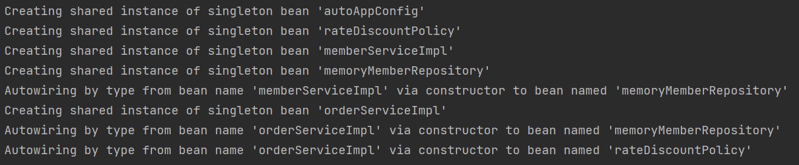
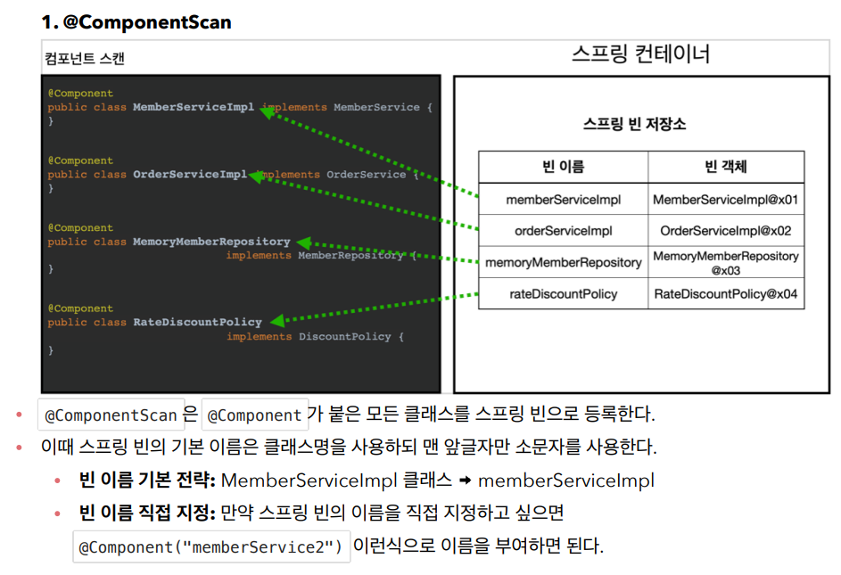
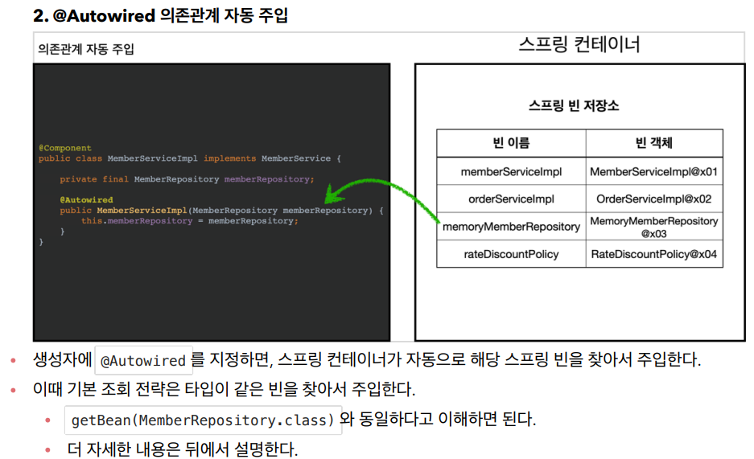
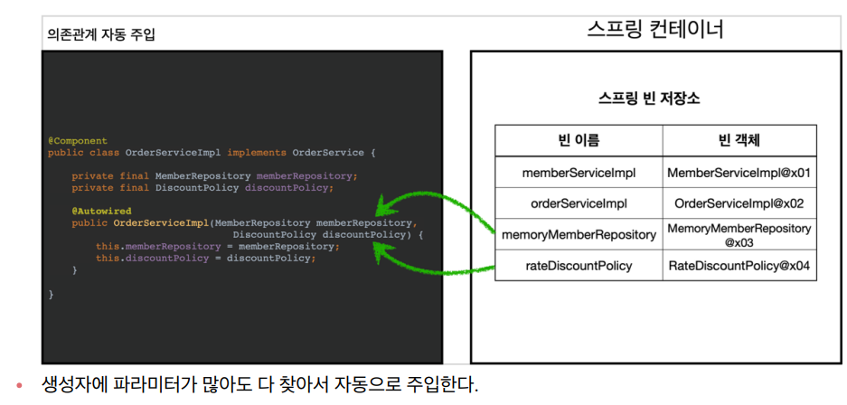
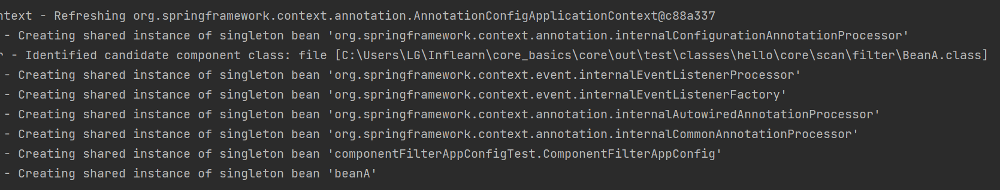

# 1. 컴포넌트 스캔과 의존관계 자동 주입 시작하기
- 지금까지 배운 스프링 빈 등록 방법 : 자바코드의 @Bean 어노테이션 또는 XML의 bean 태그
- 만약 등록해야할 빈이 기하급수적으로 늘어난다면, 이와같은 방법은 관리가 어려워짐.
- 따라서 스프링은 설정 정보 없이 자동으로 스프링 빈을 등록하는 **컴포넌트 스캔** 기능을 제공한다.
- 또한 의존관계도 자동으로 주입하는 **@Autowired** 기능도 제공한다.

## AutoAppConfig.java
```
@Configuration
@ComponentScan(
    excludeFilters = @Filter(type = FilterType.ANNOTATION, classes = Configuration.class)
)
public class AutoAppConfig {

}
```
- 컴포넌트 스캔을 사용하기 위해선 @ComponentScan을 설정 정보에 붙여준다.
    - @ComponentScan : @Component 어노테이션이 붙은 클래스들을 찾아 자동으로 스프링 빈으로 등록시켜줌
    - 이전에 AppConfig에다 @Configuration 어노테이션을 붙여준 것처럼
- 기존의 AppConfig와는 다르게 @Bean으로 등록한 클래스가 하나도 없다.
- 컴포넌트 스캔을 사용하면 @Configuration이 붙은 설정 정보도 자동으로 스프링 빈에 등록된다. 때문에 AppConfig, TestConfig 등 @Configuration이 붙은 앞서 만들어둔 설정 정보도 함께 등록되고, 실행되어 버린다. 따라서 excludeFilters를 이용하여 설정정보는 컴포넌트 스캔 대상에서 제외한다.
    - 참고로 보통 설정 정보를 컴포넌트 스캔 대상에서 제외하는 경우는 드물다. 현재는 기존 공부내용을 남기기 위한 조치일 뿐
    - @Configuration이 컴포넌트 스캔의 대상이 된 이유는 @Configuration 소스코드를 열어보면 @Component 어노테이션이 붙어있기 때문
    - excludeFilters : 컴포넌트 스캔 중 뺄 것을 지정
        - type : 어노테이션 타입으로 지정
        - classes : configuration 어노테이션이 붙었으면 제외 대상

## @Component
- 컴포넌트 스캔의 대상이 되는 클래스에 @Component 어노테이션을 붙여준다.
```
// MemoryMemberRepository
@Component
public class MemoryMemberRepository implements MemberRepository { }


// RateDiscountPolicy
@Component
public class RateDiscountPolicy implements DiscountPolicy { }


// MemberServiceImpl
@Component
public class MemberServiceImpl implements MemberService { 

    private final MemberRepository memberRepository;

    @Autowired
    public MemberServiceImpl(MemberRepository memberRepository){
        this.memberRepository = memberRepository;
    }
}
```
- 이전 AppConfig에서는 @Bean으로 직접 설정 정보를 작성했고 의존관계도 직접 명시했다. 이제는 그런 설정 정보 자체가 없으므로, 의존관계 주입도 해당 클래스 내에서 해결해야 한다.
- @Autowired는 의존관계를 자동으로 주입해준다.

## @Autowired
```
@Component
public class OrderServiceImpl implements OrderService {

    private final MemberRepository memberRepository;
    private final DiscountPolicy discountPolicy;

    @Autowired
    public OrderServiceImpl(MemberRepository memberRepository, DiscountPolicy discountPolicy){
        this.memberRepository = memberRepository;
        this.discountPolicy = discountPolicy;
    }
}
```
- @Autowired를 사용하면 생성자에서 여러 의존관계도 한번에 주입받을 수 있다.
    - MemberRepository, DiscountPolicy

## @ComponentScan, @Configuration, AutoAppConfig 정상작동 테스트 : AutoAppConfigTest.java
```
public class AutoAppConfigTest {

    @Test
    void basicScan(){
        // 설정정보로 AutoAppConfig 클래스를 넘겨줌
        ApplicationContext ac = new AnnotationConfigApplicationContext(AutoAppConfig.class);

        // 스프링 빈으로 등록된 MemberSerivce타입 객체 인스턴스를 memberService 변수에 할당
        MemberService memberService = ac.getBean(MemberService.class);

        // 스프링빈으로 등록된 객체와 MemberService.class가 동일한 객체인지 확인
        assertThat(memberService).isInstanceOf(MemberService.class);
    }
}
```
- 테스트 결과

    - 컴포넌트 스캔은 물론, 의존관계 자동 주입까지 정상 동작하는 것을 확인가능

## 정리




# 2. 탐색 위치와 기본 스캔 대상
## @ComponentScan 탐색 위치
- 컴포넌트 스캔시, 모든 자바 클래스와 라이브러리를 전부 컴포넌트 스캔하면 시간이 오래 걸리므로 필요한 위치부터 탐색할 수 있도록 시작위치를 지정할 수 있다.
```
@ComponentScan(
    basePackages = "hello.core.member",
    basePackageClasses = "AutoAppConfig"
)
```
- basePackages : 탐색할 패키지의 시작 위치를 지정한다. 이 패키지를 포함한 하위 패키지를 모두 탐색한다.
    ```
    // 다음과 같이 여러 시작 위치를 지정할 수도 있다.
    @ComponentScan(
        basePackages = "hello.core.member", "hello.core.order"
    )
    ```
- basePackageClasses : 지정한 클래스의 패키지를 탐색 시작 위치로 지정한다.
- [Default] 시작위치 지정안함 : @ComponentScan이 붙은 설정 정보 클래스의 패키지가 시작 위치가 된다.
- [Default] useDefaultFilters = true : 해당 옵션은 기본으로 켜져있는데, 이 옵션을 끄면 기본 스캔 대상들이 제외됨.

**권장 방법**
- basePackages나 basePackageClasses 등 패키지 위치를 지정하는 것보단, 설정 정보 클래스(현재는 AutoAppConfig.class)의 위치를 프로젝트 최상단에 두기
- 최근 스프링 부트도 해당 방법을 기본으로 제공
- 현재 프로젝트에서는 com.hello가 프로젝트 시작 루트이므로, 여기에 AppConfig와 같은 설정정보를 둔 후 @ComponentScan어노테이션을 붙여준다.
- 따라서 com.hello를 포함한 하위는 모두 자동으로 컴포넌트 스캔의 대상이 될 수 있음.
- 스프링 부트 시작시, 스프링 부트의 대표 시작 정보인 @SpringBootApplication을 프로젝트 시작 루트 위치에 두는 것이 관례, <U>**그리고 이 설정 안해 바로 @ComponentScan이 들어있다.**</U>
    - 따라서 스프링 부트를 사용시, @ComponentScan 을 사용할 필요가 없다. 그 이유는 @SpringBootApplication에 @ComponentScan이 이미 있는걸로 보아, 스프링 부트 자체에서 이미 컴포넌트 스캔을 해주기 때문.

## 컴포넌트 스캔 기본 대상
1. @Component : 컴포넌트 스캔에서 사용
2. @Controller : 스프링 MVC 컨트롤러에서 사용
3. @Service : 스프링 비즈니스 로직에서 사용
4. @Repository : 스프링 데이터 접근 계층에서 사용
5. @Configuration : 스프링 설정 정보에서 사용
    - 컴포넌트 스캔은 @Component뿐 아니라 위 어노테이션들도 추가로 기본 대상에 포함한다.
    - 그 이유는 해당 어노테이션의 클래스 코드를 보면 @Component를 포함하고 있기 때문
    - [참고] 어노테이션에는 상속관계라는 것이 없다. 지금처럼 어노테이션이 특정 어노테이션을 들고 있는 것을 인식하는 건, 자바 언어가 아니라 스프링이 지원하는 기능이다. 

- 아래 어노테이션은 컴포넌트 스캔의 용도 뿐만 아니라 스프링의 부가 기능을 수행한다.
    - @Controller : 스프링 MVC 컨트롤러로 인식
    - @Repository : 스프링 데이터 접근 계층으로 인식, 데이터 계층의 예외를 스프링 예외로 변환해준다.
    - @Configuration : 앞서 보았듯 스프링 설정 정보로 인식, 스프링 빈이 싱글톤을 유지하도록 추가적인 처리를 한다.
    - @Service : 사실 @Service는 특별한 처리를 하지 않는다. 대신 개발자들이 핵심 비즈니스 로직이 여기에 있겠구나라고 비즈니스 계층을 인식하는데 도움을 준다.
# 3. 필터
- includeFilters : 컴포넌트 스캔 대상을 추가로 지정
- excludeFilters : 컴포넌트 스캔에서 제외할 대상을 지정
## 사용방법
**1. 컴포넌트 스캔 대상에 추가할 애노테이션 생성**
```
@Target(ElementType.TYPE)
@Retention(RetentionPolicy.RUNTIME)
@Documented
public @interface MyIncludeComponent { }
```
- 이렇게 해주면 @MyIncludeComponent 라는 어노테이션이 만들어 진 것. 이제 컴포넌트 스캔 대상에 추가할 인스턴스가 생기면 해당 어노테이션을 붙이면 됨.
- @Target, @Retention, @Documented 어노테이션 공부 필요 !!

**2. 컴포넌트 스캔 대상에서 제외할 애노테이션 생성**
```
@Target(ElementType.TYPE)
@Retention(RetentionPolicy.RUNTIME)
@Documented
public @interface MyExcludeComponent { }
```
- @MyExcludeComponent 라는 어노테이션 생성 완료. 컴포넌트 스캔 대상에 제외할 인스턴스에 해당 어노테이션 사용하면 됨.

**3. 테스트용 빈 생성**
```
// 컴포넌트 스캔 대상에 추가할 클래스
@MyIncludeComponent
public class BeanA { }
```
```
// 컴포넌트 스캔 대상에서 제외할 클래스
@MyExcludeComponent
public class BeanB{ }
```

**4. 검증**
- 검증 전에, AppConfig만들어주기
```
public class ComponentFilterAppConfigTest {

    @Configuration
    @ComponentScan(
        includeFilters = @Filter(type = FilterType.ANNOTATION, classes = MyIncludeComponent.class),
        excludeFilters = @FIlter(type = FilterType.ANNOTATION,
        classes = MyExcludeComponent.class)
    )
    static class ComponentFilterAppConfig {

    }
}
```
- 만들어둔 테스트용 AppConfig로 스프링 컨테이너 생성 및 필터 테스트
- 예상
    - MyIncludeComponent 어노테이션을 적용한 BeanA는 스프링 빈에 등록
    - MyExcludeComponent 어노테이션을 적용한 BeanB는 스프링 빈에 없음
```
public class ComponentFilterAppConfigTest {
    
    @Test
    void filterScan(){
        ApplicationContext ac = new AnnotationConfigApplicationContext(ComponentFilterAppConfig.class);

        BeanA beanA = ac.getBean("beanA", BeanA.class);
        assertThat(beanA).isNotNull(); //스프링 컨테이너에 beanA 존재

        Assertions.assertThrows(
            NoSuchBeanDefinitionException.class,
            () -> ac.getBean("beanB", BeanB.class));
    }
}
```


- 우선 AnnotationConfigApplicationContext 객체를 생성
- AnnotationConfigApplicationContext에 넘겨준 설정정보인 ComponentFilterAppConfig 내용에 따라,
    - @MyIncludeComponent를 적용한 BeanA을 컴포넌트 스캔 추가 등록되어 콘솔에서 확인가능
    - @MyExcludeComponent를 적용한 BeanB는 컴포넌트 스캔에서 제외되었으므로 콘솔에서 확인불가

## FilterType 옵션
- ANNOTATION : 기본값, 어노테이션을 인식해서 동작
    - (ex) org.example.SomeAnnotation
- ASSIGNABLE_TYPE : 지정한 타입과 자식 타입을 인식해서 동작
    - (ex) org.example.SomeClass
- ASPECTJ : AspectJ 패턴 사용
    - (ex) org.example..*Service+
- REGEX : 정규 표현식
    - (ex) org\.example\.Default.*
- CUSTOM : TypeFilter라는 인터페이스를 직접 구현해서 처리
    - (ex) org.example.MyTypeFilter

> [참고] @Component 면 충분하므로, includeFilters를 사용할 일은 거의 없음. excludeFilters는 여러 이유로 간혹 사용할때가 있지만 많지는 않다. 특히 최근 스프링 부트는 컴포넌트 스캔을 기본적으로 제공하므로, 옵션을 변경하며 사용하기 보다는 스프링의 기본설정에 최대한 맞추어 사용하는 것을 권장한다.

# 4. 중복 등록과 충돌