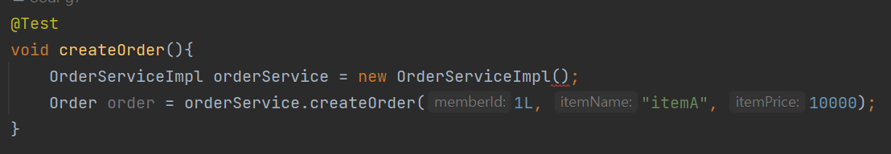
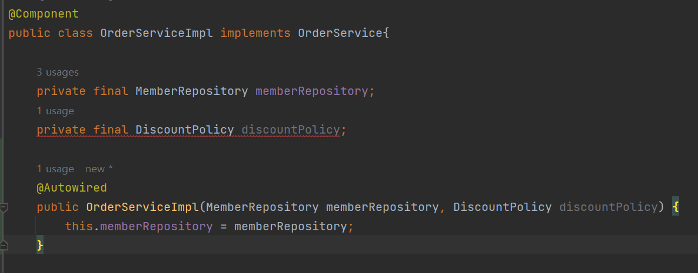
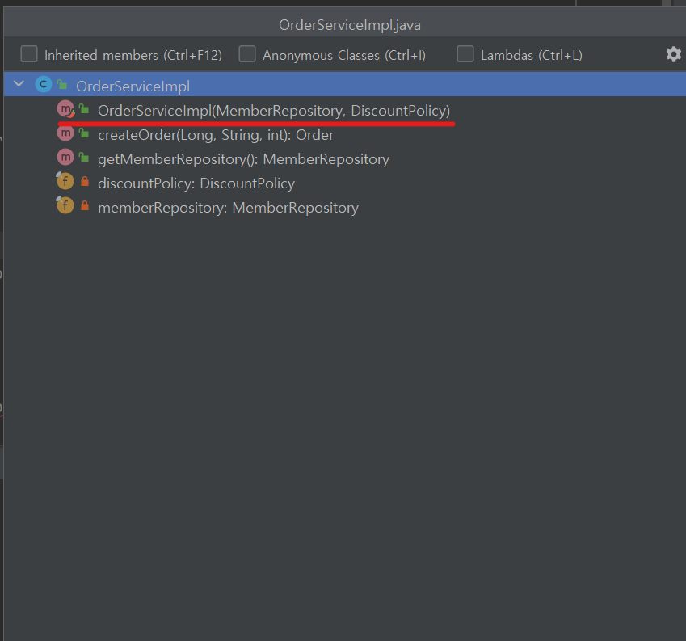

# 1. 다양한 의존관계 주입 방법
## (1) 생성자 주입
- 생성자를 통해 의존관계를 주입받음
```
@Component
public class OrderServiceImpl implements OrderService {

    // 생성자에 사용되는 필드는 final 붙이기(필수)
    private final MemberRepository memberRepository;
    private final DiscountPolicy discountPolicy;

    @Autowired
    public OrderServiceImpl(MemberRepository memberRepository, DiscountPolicy discountPolicy){
        this.memberRepository = memberRepository;
        this.discountPolicy = discountPolicy;
    }
}
```
- 특징
    - 생성자 호출 시점에 딱 1번만 호출되는 것이 보장 → 최초 한번 세팅 후 그 다음에는 세팅 불가(불변)
    - <U>**불변, 필수**</U> 의존관계에 사용
        - **불변** : 생성자를 딱 1번만 호출하기 때문에 값이 변하지 않음
        - **필수** : 생성자에서 사용하는 필드 2개는 final이 붙어 있음. 즉, memberRepository와 discountPolicy는 무조건 값이 들어가 있어야한다는 의미. 현재는 생성자 호출 시 해당 필드에 값이 채워지므로 final 필드 조건에 부합하지만, 만약 그렇지 않다면 에러 발생.
            ```
            // 에러나는 코드예시
            private final MemberRepository memberRepository;
            private final DiscountPolicy discountPolciy; // final필드인데 값이 없어서 에러나있음

            @Autowired
            public OrderServiceImpl(MemberRepository memberRepository){
                this.memberRepository = memberRepository;
            }
            ```
    - 생성자에서 사용하는 필드는 필수값으로 다 넣어주는 것이 관례 ! 만약 개발문서에 해당 필드는 null을 허용한다 라고 적혀있지 않은 이상, 생성자에서 사용하는 모든 필드는 값을 넣어주어야 한다.
    - 스프링 컨테이너에 빈을 등록함과 동시에 의존관계 자동주입도 이루어짐
        - 스프링 빈에 등록할 객체를 만들기 위해 new OrderServiceImpl()을 해야하는데, 이때 생성자 파라미터 값으로 넘겨줘야하는 객체가 있다면 그걸 스프링 컨테이너에서 찾아서 넘겨줌. 그렇기때문에 결국 생성자 주입방식은 빈 등록과 동시에 의존관계 자동주입도 이뤄짐.
- 생성자가 1개일때
    - 생성자가 1개만 있으면 @Autowired를 생략해도 자동 주입 된다. (물론 스프링 빈에만 해당)
> 좋은 개발 습관   
: 제약을 걸어 두는 것, 한계점이 명확하도록 코드를 짜는 것이 좋은 습관이다. 제약 없이 다 열어두면 어디서 수정되었는지, 내가 작성한 코드를 스스로 컨트롤할 수 없게됨.

## (2) 수정자 주입
```
@Component
public class OrderServiceImpl implements OrderService {

    private MemberRepository memberRepository;
    private DiscountPolicy discountPolicy;

    @Autowired
    public void setMemberRepository(MemberRepository memberRepository){
        this.memberRepository = memberRepository;
    }

    @Autowired
    public void setDiscountPolicy(DiscountPolicy discountPolicy){
        this.discountPolicy = discountPolicy;
    }
}
```
- 스프링 컨테이너의 2가지 라이프사이클
    - 첫째. 스프링 빈을 등록한다.
    - 둘째. 의존관계를 자동으로 주입한다.
- 수정자(setter) 주입의 경우, OrderServiceImpl을 스프링 빈으로 등록한 뒤에 @Autowired 어노테이션을 보고 의존관계를 주입시켜줌.
    - 스프링 빈 등록과 동시에 의존관계 자동주입이 이뤄지는 생성자 주입방식과는 차이점을 보임
- 특징
    - <U>**선택, 변경**</U>가능성이 있는 의존관계에 사용
        - **선택** : 예를들어, 위 코드에서 memberRepository가 아직 스프링 빈으로 등록되지 않아서 setMemberRepository() 메소드로 의존관계 주입을 못하게 되더라도, 애플리케이션은 문제 없이 정상적으로 실행됨. 
        - **참고로** 선택적으로 의존관계를 주입하기 위해서는 @Autowired에 required = false 옵션을 달아주면 된다. (ex. @Autowired(required = false))
        - **변경** : 중간에 인스턴스를 교체하고 싶으면 강제로 set메소드를 호출시켜 안에 든 인스턴스를 변경할 수 있다.
- @Autowired
    - @Autowired의 기본 동작은 주입할 대상이 없으면 오류가 발생한다. 주입할 대상이 없어도 동작하게 하려면 @Autowired(required=false)로 지정하면 된다.

## (3) 필드 주입
```
@Component
public class OrderServiceImpl implements OrderService {

    @Autowired private MemberRepository memberRepository;
    @Autowired private DiscountPolicy discountPolicy;

}
```
- 필드에 바로 주입하는 방법
- 특징
    - 코드가 매우 간결하지만, 외부에서 변경이 불가능하여 테스트하기가 매우 어렵다.
    - DI프레임워크가 없으면 아무것도 할 수 없다. (즉, 순수한 자바코드만으로 테스트하기는 불가능하다.)
    - 아래의 경우를 제외하고는 사용하지 않기!
        - 애플리케이션의 실제 코드와는 관계 없는 테스트 코드
        - 스프링 설정을 목적으로 하는 @Configuration 같은 곳에서만 특별한 용도로 사용

## (4) 일반 메서드 주입
- 일반 메서드를 통해 주입받음
- 특징
    - 한번에 여러 필드를 주입 받을 수 있다
    - 대게 생성자 주입, 수정자 주입으로 해결할 수 있으므로, 일반 메서드 주입은 잘 사용하지 않음

# 2. 옵션 처리
- 주입할 스프링 빈이 없어도 동작해야 할 때가 있다.   
그런데 @Autowired만 사용하면 'required'옵션의 기본값이 'true'로 되어있어서 자동 주입 대상이 없으면 오류가 발생

- **자동 주입대상을 옵션으로 처리하는 방법** (컨테이너에 빈이 등록안되어있어도 문제없이 작동시키는 방법)
    - @Autowired(required=false)
        - 자동 주입할 대상이 없으면 수정자 메서드 자체가 호출 안됨
        ```
        public class AutowiredTest {

            @Test
            void AutowiredTest(){
                ApplicationContext ac = new AnnotationConfigApplicationContext(TestBean.class);
            }

            static class TestBean {
                @Autowired(required = false)
                public void setNoBean1(Member noBean1){
                    System.out.println("noBean1 = " + noBean1);
                }
            }
        }
        ```
        - Member 클래스는 스프링 컨테이너가 관리하지 않는 클래스임
        - 따라서 @Autowired를 해두어도 컨테이너에 Member빈이 없으므로 아무것도 주입되지 않음
        - @Autowired 옵션의 기본값인 required = true인 상태에서 테스트를 실행해보면 'NoSuchBeanDefinitionException' 에러 발생
        - @Autowired(requried = false) 를 해뒀을 경우, 의존관계가 없으면 setNoBean1() 메소드 자체가 아예 호출되지 않음. 따라서 콘솔에 아무것도 안 찍혀 있음.
    - org.springframwork.lang.@Nullable
        - 자동 주입할 대상이 없으면 null이 입력됨
        ```
        public class AutowiredTest {

            @Test
            void AutowiredTest(){
                ApplicationContext ac = new AnnotationConfigApplicationContext(TestBean.class);
            }

            static class TestBean {
                @Autowired
                public void setNoBean2(@Nullable Member noBean2){
                    System.out.println("noBean2 = " + noBean2);
                }
            }
        }
        ```
        - noBean2은 스프링 컨테이너에 등록된 빈이없어, 자동주입할 대상이 없으므로 @Nullable을 통해 null값을 입력해준다.
        - 생성자 자동 주입에서 특정 필드에 관해 사용할 수도 있다. '해당 필드는 스프링 빈에 없어도 생성자가 호출되면 좋겠는데..' 싶을때
    - Optional<>
        - Optional : null일 수도 있고, 아닐수도 있다 라는 상태를 감싼 것.(Java 8)
        - 자동 주입할 대상이 없으면 Optional.empty 가 입력됨
        ```
        public class AutowiredTest {

            @Test
            void AutowiredTest(){
                ApplicationContext ac = new AnnotationConfigApplicationContext(TestBean.class);
            }

            static class TestBean {
                @Autowired
                public void setNoBean3(Optional<Member> noBean3){
                    System.out.println("noBean3 = " + noBean3);
                }
            }
        }
        ```
    - 전체 테스트코드 출력결과
    > noBean2 = null   
      noBean3 = Optional.empty
    1. setNoBean1() : @Autowired(required=false)이므로 호출자체가 안됨
    2. setNoBean2() : @Nullable이므로 null값 들어감
    3. setNoBean3() : Optional로 감싸져서 상태는 empty라고 나옴
- 참고
    - @Nullable, Optional은 스프링 전반에 걸쳐서 지원된다. 예를들어 생성자 자동 주입에서 특정 필드에만 사용해도 됨.
    
# 3. 생성자 주입을 선택해라!
## 생성자 주입을 선택해야 하는 이유 1 : 불변
- 대부분의 의존관계 주입은 한번 일어나면 애플리케이션 종료시점까지 의존관계를 변경할 일이 없다. 오히려 <U>**대부분의 의존관계는 애플리케이션 종료 전까지 변하면 안된다.(불변)**</U>
- 수정자 주입을 사용하면, setXxx 메서드를 public으로 열어두어야 한다.
- 누군가 실수로 변경할 수도 있고, 변경하면 안되는 메서드를 열어두는 것은 좋은 설계 방법이 아니다.
- 생성자 주입은 객체를 생성할때 딱 1번만 호출되므로 이후에 호출되는 일이 없다. 따라서 불변하게 설계할 수 있다.

## 생성자 주입을 선택해야 하는 이유 2 : 누락
- 프레임워크 없이 순수한 자바 코드를 단위 테스트 할때
    - 수정자 의존관계의 경우
        ```
        public class OrderServiceImpl implements OrderService {

            private MemberRepository memberRepository;
            private DiscountPolicy discountPolicy;

            @Autowired
            public void setMemberRepository(MemberRepository memberRepository){
                this.memberRepository = memberRepository;
            }

            @Autowired
            public void setDiscountPolicy(DiscountPolicy discountPolicy){
                this.discountPolicy = discountPolicy;
            }
        }
        ```
    - 만약 의존관계가 없을때(스프링 컨테이너에 MemberRepository 또는 DiscountPolicy가 존재하지 않을때) @Autowired가 프레임워크 안에서 동작하는 경우 오류가 발생하지만, 프레임워크없이 순수한 자바 코드로만 단위 테스트를 수행할때는 오류가 발생하지 않는다.
        - 스프링 프레임워크없이 테스트를 수행하므로, 스프링 컨테이너 내 등록된 빈을 참조하지 않기때문에 의존관계가 없는데도 오류가 발생하지 않는 것 !
        ```
        @Test
        void createOrder(){
            OrderServiceImpl orderService = new OrderServiceImpl();
            orderService.createOrder(1L, "itemA", 10000);
        }
        ```
        - 위와 같은 경우 우선 테스트는 실행이 된다. 하지만 실행 결과는 NPE(Null Point Exception)이 발생한다.
            - 그 이유는 바로 OrderServiceImpl클래스에 있는 memberRepository와 discountPolicy에 아무런 값이 할당되지 않았기 때문.
        - 동일한 코드를 생성자 주입으로 진행할 경우에는 컴파일 오류가 발생한다. 그리고 IDE에서 바로 어떤 값을 필수로 주입해야 하는지 알 수 있다.
            - 즉, 수정자 주입일 경우에는 테스트를 실행해보아야만 알 수 있었던 오류를, 생성자 주입의 경우 컴파일 단계에서 바로 확인이 가능하다.
            
            - *OrderServiceImpl 객체 인스턴스를 생성할때, 파라미터 값을 넣어주지 않자 컴파일 오류가 발생하는 것을 확인할 수 있다.*

## 생성자 주입을 선택해야 하는 이유 3 : final 키워드
- 생성자 주입을 사용하면 필드에 final 키워드를 사용할 수 있다. 그래서 생성자에서 혹시라도 값이 설정되지 않은 오류를 컴파일 시점에 막아준다.


- 필수 필드인 discountPolicy에 값을 설정해야 하는데, 이 부분이 누락되자 자바는 컴파일 시점에 다음 오류를 발생시킨다.
    - java: variable discountPolicy might not have been initialized
    - 수정자 주입을 포함한 나머지 주입 방식은 모두 생성자 이후에 호출되므로, 필드에 final키워드를 사용할 수 없다. <U>**오직 생성자 주입 방식만 final키워드를 사용할 수 있다.**</U>

## 정리
- 컴파일 오류는 세상에서 가장 빠르고, 좋은 오류다
- 생성자 주입 방식은 프레임워크에 의존하지 않고, 순수한 자바 언어의 특징을 잘 살리는 방법
- 기본으로 생성자 주입을 사용하고, 필수 값이 아닌 경우에는 수정자 주입 방식을 옵션으로 부여하면 된다. 생성자 주입과 수정자 주입을 동시에 사용할 수 있다.
- 항상 생성자 주입을 선택하기! 그리고 가끔 옵션이 필요하다면 수정자 주입을 선택하기. 필드 주입을 사용하지 않는게 좋다.

# 4. 롬복과 최신 트랜드
- 생성자 주입방식을 사용해야하는데, 코드 양이 너무 많다.
    - 필드에 final키워드
    - 생성자 코드
    - 주입받은 값을 대입하는 코드 
- 이를 깔끔하게 줄여주는 라이브러리 : 롬복(Lombok)

## 기본 코드 리팩토링
**기본코드**
```
@Component
public class OrderServiceImpl implements OrderService{

    private final MemberRepository memberRepository;
    private final DiscountPolicy discountPolicy;
    
    @Autowired
    public OrderServiceImpl(MemberRepository memberRepository, DiscountPolicy discountPolicy) {
        this.memberRepository = memberRepository;
        this.discountPolicy = discountPolicy;
    }
}
```
- 생성자가 단 1개일 경우, @Autowired를 생략가능하다.

```
@Component
public class OrderServiceImpl implements OrderService{

    private final MemberRepository memberRepository;
    private final DiscountPolicy discountPolicy;
    
    public OrderServiceImpl(MemberRepository memberRepository, DiscountPolicy discountPolicy) {
        this.memberRepository = memberRepository;
        this.discountPolicy = discountPolicy;
    }
}
```
- 이제 롬복을 적용한다.
    - 롬복 라이브러리가 제공하는 @RequiredArgsConstructor 기능을 사용하면 final이 붙은 필드를 모아서 생성자를 자동으로 만들어준다.
        - 코드에서는 보이지 않지만 실제 호출이 가능하다.
        - 정상적으로 생성이 잘 되었는지 궁금하다면 ctrl+F12 로 생성자메소드 확인이 가능하다.
        

**최종 리팩토링 코드**
```
@Component
@RequiredArgsConstructor
public class OrderServiceImpl implements OrderService{

    private final MemberRepository memberRepository;
    private final DiscountPolicy discountPolicy;
    
}
```
- 이 최종결과 코드와 이전 기본 코드는 완전히 동일하다.
- 롬복이 자바의 애노테이션 프로세서라는 기능을 이용하여 컴파일 시점에 생성자 코드를 자동으로 생성해준다.
- 만약 생성자에 추가해야할 파라미터가 있을때, final이 붙은 필드한줄만 작성해준다면 생성자 코드를 수정할 필요 없이 롬복 라이브러리가 자동으로 만들어주므로 매우 편리하게 사용가능하다.

## 정리
- 최근에는 생성자를 1개 두고 @Autowired를 생략하는 방법을 주로 사용한다.
- 여기에 Lombok라이브러리의 @RequiredArgsConstructor 까지 함께 사용하면 생성자 주입의 기능은 모두 제공하면서도, 코드는 깔끔하게 사용할 수 있다.

# 5. 조회 빈이 2개 이상 - 문제
- @Autowired는 타입(Type)으로 조회한다.
    ```
    @Autowired
    private DiscountPolicy discountPolicy
    ```
    - 그렇기에 위 코드는 아래 코드와 유사하게 동작한다. (실제로는 더 많은 기능을 제공함.)
    ```
    ac.getBean(DiscountPolicy.class)
    ```
- 타입으로 조회시, 선택된 빈이 2개 이상일때 문제가 발생한다.
- 현재 DiscountPolicy의 하위 타입인 RateDiscountPolicy에만 @Component를 붙여 빈으로 등록해두었으나, 나머지 하나인 FixDiscountPolicy에도 @Component를 붙여 둘 다 스프링 빈으로 선언해본다.
    - 결과는 NoUniqueBeanDefinitionException 오류가 발생한다.
    > No qualifying bean of type 'hello.core.discount.DiscountPolicy' available: expected single matching bean but found 2: fixDiscountPolicy,rateDiscountPolicy
    (하나의 빈을 기대했는데, fixDiscountPolicy, rateDiscountPolicy 2개가 발견되었다.)
    
- 그렇다면 이 문제를 어떻게 해결?
    - 하위 타입으로 지정하게 되면 DIP를 위배하고 유연성이 떨어져서 X
    - 그리고 이름만 다르고 완전히 똑같은 타입의 스프링 빈이 2개일때는 해결이 안된다.
    
# 6. @Autowired 필드 명, @Qualifier, @Primary
- 조회 대상 빈이 2개 이상일 때 해결방법
    1. @Autowired 필드 명 매칭
    2. @Qualifier → @Qualifier끼리 매칭 → 빈 이름 매칭
    3. @Primary 사용

## @Autowired 필드 명 매칭
1. @Autowired는 타입매칭을 시도한다.
2. 이때 여러 빈이 있으면 <U>**필드 이름, 파라미터 이름**</U>으로 빈 이름을 추가 매칭한다.
```
// 기존코드
@Autowired
private DiscountPolicy discountPolicy;
```
- DiscountPolicy 하위에는 RateDiscountPolicy와 FixDiscountPolicy 두 개가 존재.
- 타입매칭을 시도할경우 두가지의 빈이 조회되므로, 코드를 아래처럼 바꾸면 필드명 매칭이 가능해진다.
```
// 필드명을 컨테이너에 등록된 빈 이름으로 변경
@Autowired
private DiscountPolicy rateDiscountPolicy;
```
- 필드명이 rateDiscountPolicy이므로 정상 주입된다.
- **필드 명 매칭은 먼저 타입 매칭을 시도하고 그 결과로 여러 빈이 있을때 추가로 동작하는 기능이다.**

## @Qualifier 사용
- @Qualifier는 추가 구분자를 붙여주는 방법. 주입시 추가적인 방법을 제공하는 것 뿐, 빈 이름을 변경하는 것은 아님
    - (1) @Qualifier끼리 매칭한다.
    - (2) @Qualifier("...") 을 못찾았을 경우, "..."이라는 빈 이름을 매칭한다.
    - (3) "..."이라는 빈 또한 찾지 못했을 경우, NoSuchBeanDefinitionException 예외가 발생한다.
1. 빈 등록시 @Qualifier를 붙여준다.
```
@Component
@Qualifier("mainDiscountPolicy")
public class RateDiscountPolicy implements DiscountPolicy {}
```
```
@Component
@Qualifier("fixDiscountPolicy")
public class FixDiscountPolicy implements DiscountPolicy {}
```
2.  주입시 @Qualifier를 붙여주고 등록한 이름을 적어준다.
```
// 예시 - 생성자 자동 주입시
@Autowired
public OrderServiceImpl(MemberRepository memberRepository, @Qualifier("mainDiscountPolicy") DiscountPolicy discountPolicy){
    this.memberRepository = memberRepository;
    this.discountPolicy = discountPolicy;
}
```
```
// 예시 - 수정자 자동 주입시
@Autowired
public DiscountPolicy setDiscountPolicy(@Qualifier("mainDiscountPolicy") DiscountPolicy discountPolicy) {
    this.discountPolicy = discountPolicy;
}
```
- @Qualifier로 주입할때 @Qualifier("mainDiscountPolicy")를 못찾으면 어떻게 될까?
    - @Qualifier로 등록한 이름인 mainDiscountPolicy라는 이름의 스프링 빈을 추가로 찾는다.
    - 하지만 @Qualifier는 @Qualifier를 찾는 용도로만 사용하는 것이 명확하고 좋음
3. 기타 - 직접 빈 등록시에도 @Qualifier사용가능
```
@Bean
@Qualifier("mainDiscountPolicy)
public DiscountPolicy discountPolicy(){
    return new ...
}
```

## @Primary 사용
- @Primary는 우선순위를 정하는 방법.
- @Autowired 시 여러빈이 매칭되면 @Primary 어노테이션이 붙은 클래스가 우선권을 가진다.
```
// RateDiscountPolicy가 우선권을 가지도록 한다.
@Component
@Primary
public class RateDiscountPolicy implements DiscountPolicy {}

@Component
public class FixDiscountPolicy implements DiscountPolicy {}
```
```
// 생성자
@Autowired
public OrderServiceImpl(MemberRepository memberRepository, DiscountPolicy discountPolicy){
    this.memberRepository = memberRepository;
    this.discountPolicy = discountPolicy;
}

// 수정자
@Autowired
public DiscountPolicy setDiscountPolicy(DiscountPolicy discountPolicy){
    this.discountPolicy = discountPolicy;
}
```
- 코드를 실행해보면, @Primary 어노테이션을 갖고 있는 RateDiscountPolicy가 정상적으로 주입된 것을 확인할 수 있다.

### @Qualifier VS @Primary
- @Qualifier의 단점은 주입 받을때 모든 코드에 @Qualifier를 붙여주어야 한다는 점이다.
- @Primary를 사용하면 @Qualifier와는 다르게 모든 코드에 어노테이션을 붙일 필요가 없다.
- @Qualifier와 @Primary 활용
    - 자주 사용하는 메인DB커넥션 획득빈과, 가끔 사용하는 서브DB커넥션 획득빈이 있을때, 메인DB커넥션 획득빈은 @Primary를 적용하여 조회하는 곳에서 @Qualifier지정 없이 편리하게 조회하고, 가끔 서브DB커넥션이 필요할때는 @Qualifier를 지정하여 명시적으로 획득하는 방식 사용하면 코드를 깔끔히 유지 가능.
- 우선순위
    - @Primary는 기본값처럼 동작, @Qualifier는 매우 상세하게 동작
    - 두 어노테이션이 모두 붙어있을때, @Qualifier가 우선권을 갖는다.

# 7. 애노테이션 직접 만들기
# 8. 조회한 빈이 모두 필요할 때, List, Map
# 9. 자동, 수동의 올바른 실무 운영 기준